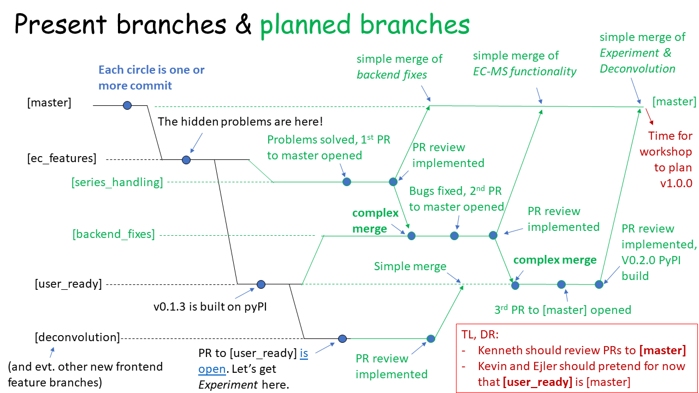

================
Developing ixdat
================

If there's an experimental technique or analysis procedure or database or that ixdat
should support and doesn't, it might be because **you** haven't coded it yet.

Here are a few resources to help you get started developing ixdat.

Github
******

The source code for ixdat (and this documentation) lives at:
https://github.com/ixdat/ixdat

Note, we are currently compiling from the
`[user_ready] <https://github.com/ixdat/ixdat/tree/user_ready>`_
branch, not the master branch.

To develop ixdat, you will need to use git and github. This means

- `install git <https://git-scm.com/downloads>`_. Git bash is strongly recommended for Windows
- Create an account at https://github.com
- Clone the repository. Navigate in the terminal which you will use for git (e.g. git bash) to
  the location that you want the repository (e.g. ``/c/Users/your_user_name/git/``), and type::

    git clone https://github.com/ixdat/ixdat

- Install ixdat from the repository to use the ixdat code you're working on. You can do this in a virtual environment,
  but it is simpler to just install it dynamically. In your terminal or Anaconda Prompt, navigate
  to the folder which contains the ixdat project folder (e.g. ``/c/Users/your_user_name/git/``)
  and type::

    pip uninstall ixdat
    pip install -e ixdat

  If you want to go back to using the released version later, just re-install it from PyPi::

    pip install --upgrade ixdat

- Make a branch using::

    git branch my_branch_name
    git checkout my_branch_name

- Develop your feature, commiting regularly and pushing regularly to your github account.

- When it's ready (i.e., works like you want, and passes linting and testing), make a pull request!
  A pull request (PR) is an awesome open review process that gives others a chance to comment and suggest
  improvements in your code before it's merged into the main ixdat package. You can see
  existing pull requests at https://github.com/ixdat/ixdat/pulls

style
*****

We do our best to follow the conventions at

- code style guide: https://www.python.org/dev/peps/pep-0008/
- docstring style guide: https://www.python.org/dev/peps/pep-0257/

Exceptions include

- It's fine to capitalize names for a quantity that is conventionally capitalized in equations (`T` for temperature, for example).

The tools **black** and **flake8** help us keep the style up to standards.

tools
*****

We use tools to make sure that our code is both functional and pretty. This makes it
easier to work together. See instructions for the tools in `tools.rst <https://github.com/ixdat/ixdat/blob/series_handling/TOOLS.rst>`_

Note on ongoing developments
****************************

If you develop now, pretend that **[user_ready]** is the master branch. We are working
though some issues in the guts of ixdat to make sure it'll be able to scale to large
projects with SQL backends. Hopefully this won't change the API much, so that the updated
guts won't require changes in your code. Here is what we're going through:

    Git plan as of 21F03 (June 3, 2021)

Write to us
***********
We'd love to know what you're working on and help with any issues developing, even
before you make a PR.

For now, best to reach Soren at sbscott@ic.ac.uk