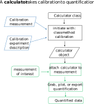

# Calculators 

Calculations involving data from `Measurement`s in ixdat are handled by 
objects called `Calculator`s. Calculators can be attached to measurements
in order to make the data that they calculate seem seamlessly part of the
measurement.

Example workflow:

<pre>
from ixdat import Measurement
from ixdat.calculators import <b>MSCalculator</b>, MSInlet

# calibration experiment

meas1 = Measurement.read(...)

# calibration

<b>calc = MSCalculator.gas_flux_calibration</b>(

    measurement=meas1,
    mol=“H2”,
    mass=“M2”,
    tspan=[100, 200],
    inlet=MSInlet(),

)

# data to be quantified 

meas2 = Measurement.read(...)

meas2.add_calculator
(<b>calc</b>)

# quantification

t, n_dot_H2 = meas2.grab(“n_dot_H2”, tspan=[400, 500])

meas2.plot(mol_list=[“H2”])

</pre>