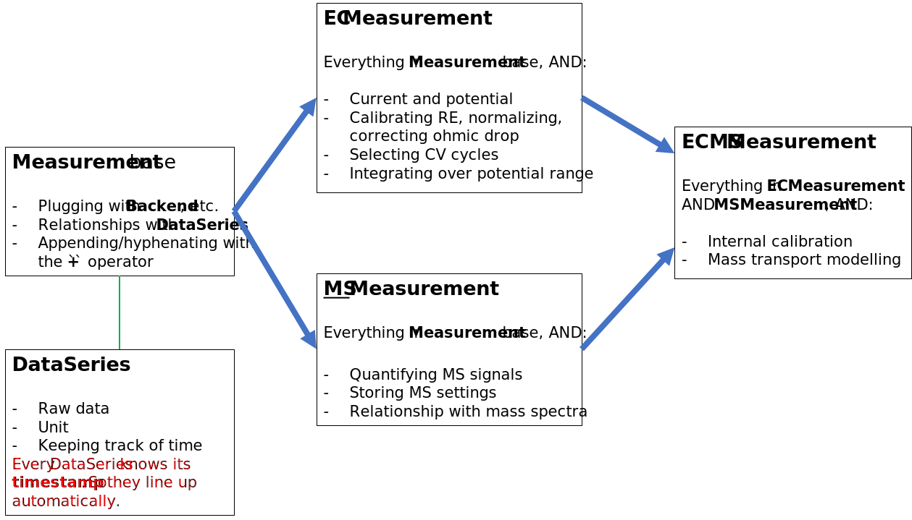

.. _measurement:

The ``Measurement`` class in the center
=======================================

The **measurement** (``meas``) is the central object in the pluggable structure of ixdat, and the
main interface for user interaction. A measurement is an object of the generalized class
``Measurement``, defined in the ``measurements`` module, or an inheriting
***TechniqueMeasurement*** class defined in a module of the ``techniques`` folder
(see :ref:`techniques`).

The general pluggable structure is defined by ``Measurement``, connecting every
measurement to a *reader* for importing from text, a *backend* for saving and loading in
``ixdat``, a *plotter* for visualization, and an *exporter* for saving outside of ``ixdat``.
Each TechniqueMeasurement class will likely have its own default reader, plotter, and
exporter, while an ``ixdat`` session will typically work with one backend handled by the
``db`` model.

.. image:: ../../figures/pluggable.svg
  :width: 600
  :alt: Design: pluggability

Subclasses for measurement techniques
-------------------------------------
The TechniqueMeasurement subclasses are structured such that they all inherit basic properties and methods from the ``Measurement`` base class. Additionally, classes for related techniques, in particular for combined techniques, inerit from more general other technique classes for shared functionality. The figure below shows this with the ``ECMSMeasurement`` subclass inheriting both EC specific methods (e.g.: cycle selection) and MS specific methods (e.g.: gas calibration), as well as providing additional methods relevant for the combined technique (e.g.: EC calibration). 

A full list of TechniqueMeasurement classes can be found in :ref:`techniques`.

What's in a measurement
-----------------------
A measurement is basically a wrapper around a collection of ``data_series`` (see
:ref:`data_series`).

There are several ways of interracting with a measurement's ``data_series``:

- Most TechniqueMeasurements provide attribute-style access to essential DataSeries and
  data. For example, ``ECMeasurement`` has properties for ``potential`` and ``current`` series,
  as well as ``t``, ``v``, and ``j`` for data.
- ``meas.grab()`` is the canonical way of getting numerical data out of a
  measurement. Given the name of a ``ValueSeries``, it returns two numpy arrays, ``t`` and ``v``
  where ``t`` is the time (wrt ``meas.tstamp``) and ``v`` is the value as a function of that
  time vector. ``grab`` takes a series name as its first argument and can also take a ``tspan``
  argument in which case it cuts the vectors to return data for the specific timespan of
  the measurement.
- Indexing a measurement with the name of a data series returns that data series, with
  any time values tstamp'd at ``meas.tstamp``
- The names of the series are available in ``meas.series_names``.
- The raw series are available in ``meas.series_list``.

The ``measurements`` module
---------------------------
Here is the full in-line documentation of the ``measurements`` module containing the
``Measurement`` class.

.. automodule:: ixdat.measurements
    :members:
