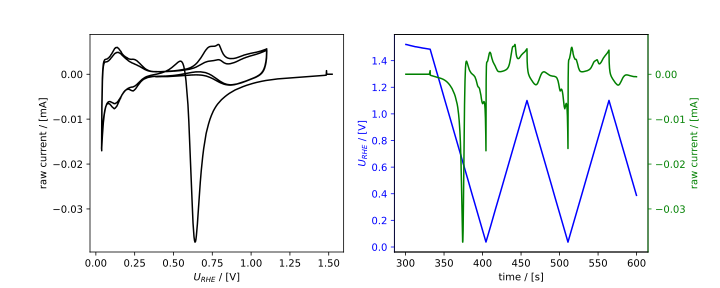

.. _electrochemistry:

Electrochemistry
================

``ECMeasurement``
.................

The main TechniqueMeasurement class for electrochemistry is the ``ECMeasurement`` class.
Subclasses of ``ECMeasurement`` include ``CyclicVoltammogram`` and ``CyclicVoltammogramDiff``.

Direct-current electrochemistry measurements are characterized by the essential quantities being
working-electrode current and potential (vs the reference electrode) as a function of time. Either 
current or potential can be controlled as the input variable, so the other acts as the response, 
and it is common to plot current vs potential, but in all cases both are tracked or controlled as 
a function of time. This results in the essential variables ``t`` (time), ``U`` (potential), and ``J``
(current). The main job of ``ECMeasurement`` and subclasses is to give standardized,
convenient, and powerful access to these three variables for data selection, analysis,
and visualization, regardless of which hardware the data was acquired with.
At the present, ``ixdat`` does not yet offer specific functionality for electrochemical impedance spectroscopy (EIS) data.

The default plotter, :ref:`ECPlotter <ec-plotter>`, plots these variables.
The default exporter, :ref:`ECExporter <ec-exporter>`, exports these variables as well as an incrementer for
selecting data, ``selector``.

Electrochemistry is the most thoroughly developed technique in ``ixdat``. For in-depth
examples of the functionality in the ``ECMeasurement`` class and its subclasses, see
the following Tutorials:

- :ref:`data_in_and_out`

- :ref:`ec_tutorials`

The full module documentation is available below: :ref:`ec_module`. 

``CyclicVoltammogram``
......................

``CyclicVoltammogram`` inherits from ``ECMeasurement`` and adds useful functionality for
cyclic voltammetry analysis. This includes:

- Current vs potential as the default ``plot()`` (same as ``plot_vs_potential()`` for an ``ECMeasurement``).
- A new counter, ``cycle``, which counts cycles. At first this counter will point to
  a counter in the raw data, if available (Biologic, for example, exports a "cycle number"
  column). However, it is recommended to control this counter yourself using the
  ``redefine_cycle`` method. For example ``my_cv.redefine_cycle(start_potential=0.4, redox=False)``
  makes ``cycle`` increment each time the potential passes 0.4 V in the cathodic direction.
- The ability to select a cycle by indexing with an integer. For example ``my_cv[1]``
  is a ``CyclicVoltammogram`` containing the first full cycle.
- A new built-in series, ``scan_rate``. This is derived automatically from ``potential``
  and stored in V/s. It can be grabbed (``t, v_scan = my_cv.grab("scan_rate")``), indexed,
  or plotted like anything else.
- An additional function ``select_sweep`` which can select a portion of the CV where the
  potential is scanned through a certain range.
- A ``calc_capacitance`` function which uses the two above to calculate capacitance in Farads.

A common workflow is to read in cyclic voltammetry data as an ``ECMeasurement``, convert
it to a ``CyclicVoltammogram`` with the ``as_cv()`` method, tell it when to increment the
cycle with ``redefine_cycle()``, coplot potential and cycle vs time with ``plot_measurement()``
to see which cycle number to use, and then index to analyze or plot individual cycles.
For example, to coplot two cycles (the sedond and the 50th) which both start and end at
0.2 V in the anodic direction:

  >>> from ixdat import Measurement
  >>> my_ec_meas = Measurement.read("my_data.mpt", reader="biologic")
  >>> my_cv = my_ec_meas.as_cv()
  >>> my_cv.redefine_cycle(start_potential=0.2, redox=True)
  >>> my_cv.plot_measurement(J_name="cycle")   # co-plots potential and cycle counter
  >>> ax = my_cv[2].plot(color="b", label="earlier")
  >>> my_cv[50].plot(ax=ax, color="r", label="later")
  >>> ax.legend()
  >>> ax.get_figure().savefig("two_cycles.png")

Note that ``as_cv()`` is available for any hyphenated technique which inherits from ``ECMeasurement``,
such as ``ECMSMeasurement``, and that all the data from the second technique (here MS)
comes along for the ride when using the cycle counter to select data. For full documentation of the cyclic voltammetry
module see below: :ref:`cv_module`

.. _ec_module:

The ``ec`` module
-----------------
Source: https://github.com/ixdat/ixdat/tree/user_ready/src/ixdat/techniques/ec.py

  left: ``ECMeasurement.plot_vs_potential()`` right: ``ECMeasurement.plot_measurement()``. `See tutorial <https://github.com/ixdat/tutorials/blob/main/simple_ec_analysis/difference_between_two_cvs.ipynb>`_

.. automodule:: ixdat.techniques.ec
    :members:

.. _`cyclic_voltammetry`:

The ``cv`` module
-----------------
Source: https://github.com/ixdat/ixdat/tree/user_ready/src/ixdat/techniques/cv.py

.. figure:: ../../../figures/cv_diff.svg
  :width: 300
  :alt: Example ``CyclicVoltammagramDiff`` plot

  output of ``CyclicVoltammagramDiff.plot()``.  `Tutorial <https://github.com/ixdat/tutorials/blob/main/loading_appending_and_saving/export_demo_data_as_csv.ipynb>`_.

.. automodule:: ixdat.techniques.cv
    :members: