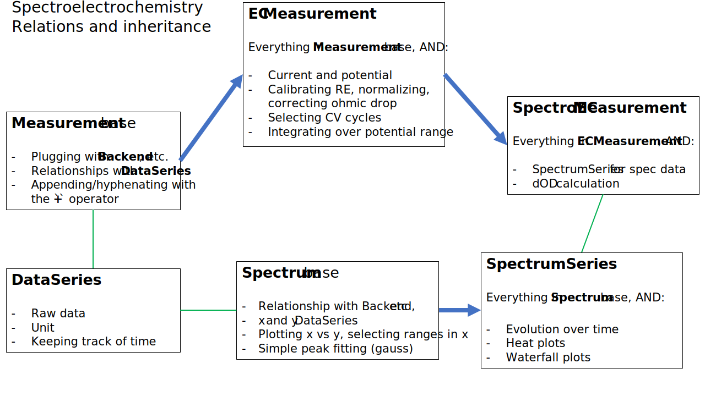

.. _sec:

Spectro-Electrochemistry
========================

Spectro-Electrochemsitry (S-EC) can refer to (i) a broad range of in-situ techniques
hyphenating electrochemistry to some kind of spectrometry (see e.g.
`Lozeman et al, 2020 <https://doi.org/10.1039/c9an02105a>`_
) or (ii) more specifically,
the combination of electrochemistry and visible-light spectroscopy. In ``ixdat``, we
use the latter meaning.

S-EC data is organized in a ``SpectroECMeasurement``, which inherits from ``ECMeasurement``
(see :ref:`electrochemistry`) and uses a ``SpectrumSeries`` (see :ref:`Spectra <spectra>`)
for managing the 2-D data array formed by the sequential spectra (see Figure).
To this, the class adds delta optical density (``dOD``) calculations. Methods
such as ``calc_dOD``, ``get_dOD_spectrum``, and ``track_wavelength`` take as
an optional argument a specification of the time/potential/spectrum index to
use as the reference for optical density calculation. If not provided, the
object's ``reference_spectrum`` is used, which itself can be set by the
``set_reference_spectrum`` method.

The data structure is the same whether the experiment is done as a slow potential scan with
adsorption vs potential in mind, or as a potential jump or release with time-resolved
behavior in mind.

Plots of S-EC are made by the  :ref:`SECPlotter <sec-plotter>`. These are either heat plots
(``plot_measurement`` and ``plot_vs_potential``) or coplotted cross-sections (``plot_waterfall``
and ``plot_wavelengths``). :ref:`Exporting SEC data <sec-exporter>` results in a master file with
the EC data and any tracked wavelengths and two auxiliary files with (i) the
spectrum series and (ii) the reference spectrum.

A :ref:`jupyter notebook tutorial <sec-tutorial>` for S-EC is available.

Fitting of spectroelectrochemistry data is not yet supported in ``ixdat``.

The ``spectroelectrochemistry`` module
......................................

.. automodule:: ixdat.techniques.spectroelectrochemistry
    :members: