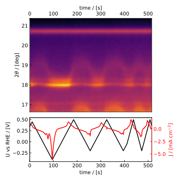

.. _concept:

================
Extended concept
================

    The power of combining techniques (fig made with ``EC_Xray``, an ``ixdat`` precursor)

*By Soren B. Scott, 20H03 (August 3, 2020)*

My idea is that ``ixdat`` will have two "faces":

1. The first face is towards the raw data and the experimenter. Here, by "combining techniques", we mean making one dataset out of separately saved data files. Electrochemistry - Mass Spectrometry (EC-MS) is a perfect example, where, typically one has data files for the potentiostat and the mass spectrometer and the data tool has to line them up in time and make one dataset for the methods to be analyzed simultaneously (in contrast to some proprietary softwares like Spectro Inlets' Zilien which combine the datasets during acquisition, but inevitably make tradeoffs in the process). This will be the core of what ixdat does. On top of that, it will have a lot of auxiliary functionality for low-level analysis of typical combined datasets - for example automated calibration of the MS data based on electrochemistry (like using the electrode current during steady hydrogen evolution to calibrate the |H2| signal). 

2. The second face is towards the results and the high-level researcher (maybe but maybe not the same person as the experimenter). Here, by "combining techniques" we mean querrying results. 

   a. On the first level, this just means for a single research project, so that it's easy for a researcher to instantly get visual and numerical answers based on their experimental data to impromptu questions of arbitrarily complexity like "how does manganese composition as measured by XPS correlate with total metal dissolution between 1.5 and 1.6 V vs RHE only for samples that were measured within 1 day of deposition?" ... which would take hours of reorganizing and manually filtering excel sheets, even if the necessary information was recorded, without a tool like this. Each result in this database will contain references to the raw data, so that a new analysis procedure (say, a corrected MS calibration or XPS peak fitting algorithm) can be plugged in and the appropriate data reanalyzed with just a few lines of code. So, combining techniques here doesn't mean new hyphenated experiments, it just means keeping the data and metadata from multiple techniques in the same place. The same well-organized, programatically accessible, place.

   b. On the second level, this should connect to an online database which has directly comparable results from multiple experimental groups. It should integrate seemlessly with the local database described above, so that a researcher in the middle of a project can answer questions like "How does my turn-over-frequency for ethylene at -0.5 V vs RHE compare with that measured previously on bimetallic samples for which post-experiment XPS data is available" with just a few lines of code. The same researcher, when they finish the project and publish, should be able to with the "click of a button" then make their own data public, satisfying the data openness requirement of some funding sources in a useful way by expanding the database for other users. 

There are two reasons to combine these two faces into one piece of software, one descriptive and one prescriptive.

- The descriptive motivation is that "syncing" data acquired simultaneously by multiple techniques is a similar problem to "syncing" results acquired separately for high-level analysis. Both are best accomplished with a relational structure, grouping elementary datasets based on metadata. In the first type of syncing, the most important metadata is the timestamp - in the second, it may be the reaction or the potential or the class of samples. Because the descriptions of the two problems have a fundamental similarity, it seems natural to draw a bridge between them.

- The prescriptive motivation is to "lure in" experimental researchers with a tool to automate the tedious task of lining their combined in-situ datasets in time, and then give them, in the same environment, standardized analysis tools, a means of comparing their results to the state-of-the-art, and a quick convenient way to open-sourcing their own data. All of this should improve the overall quality and standardization of experimental research. "Complex technique" should not be an excuse for a lack of transparency, and no valuable insight should be allowed to hide behind inconsistent data presentation. ``ixdat`` will an open-source platform in which the implementations of state-of-the-art data analysis and presentation, developed by the community, can be prescribed to the researchers who benefit from best practices.

``ixdat`` will be a collaborative project for which anyone with time and programming skill can plug in extra tools for their technique or an existing database for their sub-field.

The design should be highly pythonic: object-oriented, pluggable, and dynamic. It must be well-documented to facilitate a diverse group of users.

In the near-to-mid future, ``ixdat`` will require a bit of programming skill from the user, but, if there is interest, select functionality all the way from raw data to database will eventually have GUIs attached to it.

.. |H2| replace:: H\ :sub:`2` \