.. _data_in_and_out:

=======================
Getting data in and out
=======================

Tutorial 1: Reading and using data
==================================

Loading, selecting, calibrating, and exporting

Contents: - Setup - Loading raw data - Accessing and plotting data from
a Measurement object - Appending data from multiple Measurements -
Saving to ixdat - Selecting data and adjusting the starting time -
Exporting

Setup
-----

Install ixdat using ``pip install ixdat`` in your terminal or Anaconda
prompt. (See here for details:
https://ixdat.readthedocs.io/en/latest/introduction.html#installation)

This tutorial requires you to download a few big raw data files. They
are available here:
https://www.dropbox.com/sh/ag3pq7vqwuapd0o/AAB2Vqs6ZLZuFuMGp2ZeeWisa?dl=0

Loading raw data
----------------

This first block defines where the data is and tells us the contents of
the folder.

You have to change the data directory variable to point to the data
files on your computer.

.. code:: ipython3

    from pathlib import Path
    data_directory = Path.home() / "Dropbox/ixdat_resources/tutorials_data/extended_platinum_ec"
    [f.name for f in data_directory.iterdir()]

.. parsed-literal::

    ['01_demo_02_OCV_C01.mpt', '01_demo_03_CVA_C01.mpt', '01_demo_04_CP_C01.mpt']

And now we’re ready to read it with ixdat!

The general way to load a file with ``ixdat is Measurement.read()``

.. code:: ipython3

    from ixdat import Measurement
    
    cv_meas = Measurement.read(
        data_directory / "01_demo_03_CVA_C01.mpt", reader="biologic"
    )
    
    cv_meas  # Notice that it is an ECMeasurement, because of the reader used.

.. parsed-literal::

    importing ixdat v0.2.3 from C:\Users\MyUsername\anaconda3\lib\site-packages\ixdat\__init__.py
    
    ----------  Importing EC_MS v0.7.5 ----------
    from C:\Users\MyUsername\anaconda3\lib\site-packages\EC_MS\__init__.py
    
    
    wasnt able to evaluate '====='
    wasnt able to evaluate '====='
    wasnt able to evaluate '====='
    

.. parsed-literal::

    ECMeasurement(id=1, name='01_demo_03_CVA_C01.mpt')

These are the available readers (the list will be expanded!):

.. code:: ipython3

    from ixdat.readers import READER_CLASSES  # just to check it out. Normally you won't need this.
    
    READER_CLASSES  # a python dictionary. The keys are the names associated with each reader class

.. parsed-literal::

    {'ixdat': ixdat.readers.ixdat_csv.IxdatCSVReader,
     'biologic': ixdat.readers.biologic.BiologicMPTReader,
     'avantage': ixdat.readers.avantage.AvantageAVGReader,
     'autolab': ixdat.readers.autolab.NovaASCIIReader,
     'ivium': ixdat.readers.ivium.IviumDatasetReader,
     'chi': ixdat.readers.chi.CHInstrumentsTXTReader,
     'pfeiffer': ixdat.readers.pfeiffer.PVMassSpecReader,
     'rgasoft': ixdat.readers.rgasoft.StanfordRGASoftReader,
     'cinfdata': ixdat.readers.cinfdata.CinfdataTXTReader,
     'zilien': ixdat.readers.zilien.ZilienTSVReader,
     'zilien_tmp': ixdat.readers.zilien.ZilienTMPReader,
     'zilien_spec': ixdat.readers.zilien.ZilienSpectrumReader,
     'EC_MS': ixdat.readers.ec_ms_pkl.EC_MS_CONVERTER,
     'msrh_sec': ixdat.readers.msrh_sec.MsrhSECReader,
     'msrh_sec_decay': ixdat.readers.msrh_sec.MsrhSECDecayReader,
     'xrdml': ixdat.readers.xrdml.XRDMLReader,
     'qexafs': ixdat.readers.qexafs.QexafsDATReader}

Accessing and plotting data from a Measurement object
-----------------------------------------------------

Let’s look at the actual data in the measurement that we just imported.
The best way to get the numerical data (numpy arrays) is using
``grab()``.

.. code:: ipython3

    cv_meas.grab("Ewe/V")  # "Ewe/V" is what Biologic calls working electrode potential in its files.

.. parsed-literal::

    (array([  124.69599676,   132.59569669,   137.13579655, ...,
            24955.17924404, 24956.17924404, 24957.17944407]),
     array([ 0.26907662,  0.26958525,  0.27438352, ..., -0.31354702,
            -0.31236425, -0.31295562]))

``grab()`` gives two numpy arrays. The first is time, the second is the
variable. With these vectors, you can - do math - plot, like this:

.. code:: ipython3

    from matplotlib import pyplot as plt  # the standard plotting library
    
    t, v = cv_meas.grab("Ewe/V")
    plt.plot(t, v)
    
    # plt.gca().set_xlim([13000, 15000])  # you can zoom in using an xaxis limit

.. parsed-literal::

    [<matplotlib.lines.Line2D at 0x1cfd1178c10>]

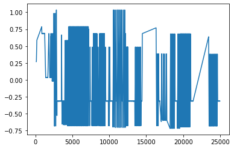

Rather than using matplotlib to zoom in, we can also use ``ixdat`` to
select the data before plotting:

.. code:: ipython3

    t, v = cv_meas.grab("Ewe/V", tspan=[13000, 15000])
    plt.plot(t, v)

.. parsed-literal::

    [<matplotlib.lines.Line2D at 0x1cfd11c96a0>]

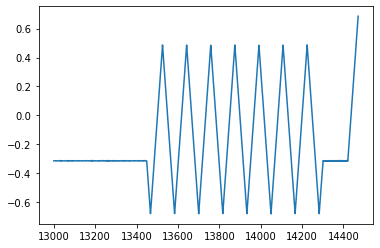

Beter yet, we can use ixdat to plot it for us directly.

.. code:: ipython3

    cv_meas.plot_measurement()   # plot_measurement() plots data on a time axis.

.. parsed-literal::

    [<AxesSubplot:xlabel='time / [s]', ylabel='Ewe/V'>,
     <AxesSubplot:ylabel='<I>/mA'>]

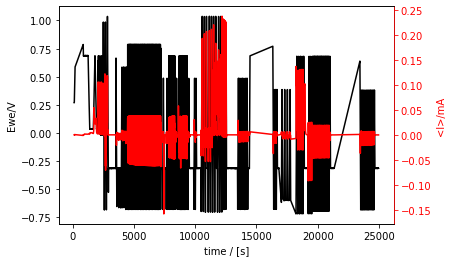

A few things to notice: - Potential is on the left y-axis and current on
the right, so we have all the essential electrochemistry info! But what
if we wanted to plot something else? - It’s the whole data set. That is
a lot. 7 hours worth! - We didn’t specify the colors (black for
potential and red for current). ``ixdat`` guessed that for us. - The
reference electrode potential is not calibrated - There are holes in the
data (for example at 23000 s)

Every object in ixdat is (should be!) documented. Including the
``plot_measurement`` method. So you can check out what it does using
python’s ``help()`` function. This addressess several of the points
above:

.. code:: ipython3

    help(cv_meas.plot_measurement)

.. parsed-literal::

    Help on method plot_measurement in module ixdat.plotters.ec_plotter:
    
    plot_measurement(*, measurement=None, tspan=None, U_name=None, J_name=None, U_color=None, J_color=None, V_str=None, J_str=None, V_color=None, axes=None, **plot_kwargs) method of ixdat.plotters.ec_plotter.ECPlotter instance
        Plot two variables on two y-axes vs time
        
        All arguments are optional. By default it plots potential in black on the left
        y-axis and current in red on the right y-axis, using data from its entire
        measurement. The axes are colored to match the traces and labeled with the
        respective series names.
        
        Args:
            measurement (Measurement): The measurement to plot, if not the one the
                plotter was initiated with.
            tspan (iter of float): The timespan (wrt to measurement.tstamp) to plot.
            axes (list of matplotlib.Axis): Two axes to plot on, if not the default
                new twinx()'d axes. axes[0] is for `U_name` and axes[1] for `J_name`.
            U_name (string): The name of the ValueSeries to plot on the left y-axis.
                Defaults to measurement.V_str, which for an ECMeasurement is the name
                of its most calibrated/correct potential.
            J_name (string): The name of the ValueSeries to plot on the right y-axis.
                Defaults to measurement.J_str, which for an ECMeasurement is the name
                of its most normalized/correct current.
            U_color (str): The color to plot U_name. Defaults to black.
            J_color (str): The color to plot J_name. Defaults to red.
            V_str (str): DEPRECATED. Use `U_name`.
            J_str (str): DEPRECATED. Use `J_name`.
            V_color (str): DEPRECATED. Use `U_color`.
            **plot_kwargs (dict): Additional key-word arguments are passed to
                matplotlib's plot() function. See below for a few examples
        
        Keyword Arguments:
            linestle (str): Type of line, e.g. "-" for solid or "--" for dotted
        
        Returns list of matplotlib.pyplot.Axis: The axes plotted on.
    
    

Awesome, that answers most of our questions!

Play with the plot customization, using e.g. tspan, V_color, J_color,
and kwargs like linestyle

.. code:: ipython3

    cv_meas.plot_measurement(
        tspan=[16000, 17000],   # comment out or uncomment this and following lines!
        # V_color="blue",
        # linestyle="--",
    )

.. parsed-literal::

    [<AxesSubplot:xlabel='time / [s]', ylabel='Ewe/V'>,
     <AxesSubplot:ylabel='<I>/mA'>]

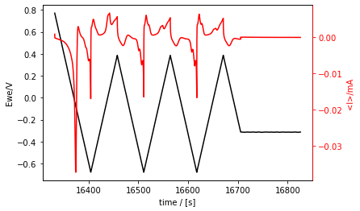

With regards to the missing parts of the dataset, those are in other
files and we will get to it in a bit.

First, the reference electrode potential. This is managed with the
``calibrate_RE`` method with takes a number ``RE_vs_RHE`` as its
argument. This is the potential of the *reference electrode* on the RHE
scale (not the reverse).

.. code:: ipython3

    cv_meas.calibrate_RE(RE_vs_RHE=0.715)  # this calibrates the reference electrode potential!

Now, if we plot a measurement, it is calibrated!

.. code:: ipython3

    cv_meas.plot_measurement(
        tspan=[13000, 14000]
    )
    # how would you plot uncalibrated potential in a measurement that has been calibrated? (see help(plot_measurement))

.. parsed-literal::

    [<AxesSubplot:xlabel='time / [s]', ylabel='$U_{RHE}$ / [V]'>,
     <AxesSubplot:ylabel='<I>/mA'>]

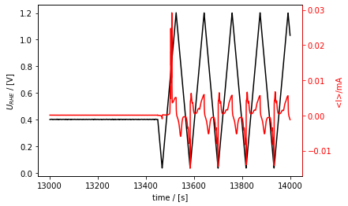

**Appending data from multiple measurements**
---------------------------------------------

The main value proposition of ixdat is to facilitate combining datasets.
This is done with the ``+`` operator.

Biologic EC-Lab measurements are a perfect example of where this is
necessary. EC-Lab makes it easy to build looped techniques, but saves
each sub-technique to its own file. Here, we loop between zero-current
(OCP), scanning (CVA), and constant-current (CP) techniques. The
``cv_meas`` object we’ve worked with so far only has the CVA data.

First, let’s load the OCP and CP techniques and plot them seperately:

.. code:: ipython3

    ocp_meas = Measurement.read(
        data_directory / "01_demo_02_OCV_C01.mpt", reader="biologic"
    )
    ocp_meas.plot_measurement()
    
    cp_meas = Measurement.read(
        data_directory / "01_demo_04_CP_C01.mpt", reader="biologic"
    )
    cp_meas.plot_measurement()

.. parsed-literal::

    [<AxesSubplot:xlabel='time / [s]', ylabel='Ewe/V'>,
     <AxesSubplot:ylabel='I/mA'>]

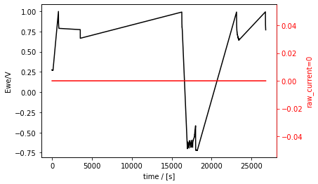

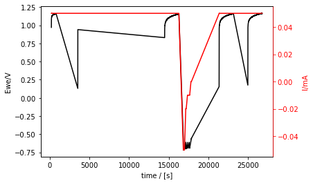

There are also clearly holes in those data sets (much bigger holes,
since most of the measurement time was in CVA).

To get the combined dataset, we append the three individual datasets
using ``+``, like this:

.. code:: ipython3

    combined_meas = cv_meas + ocp_meas + cp_meas
    # and, we plot it right away to check if it worked:
    combined_meas.plot_measurement()

.. parsed-literal::

    [<AxesSubplot:xlabel='time / [s]', ylabel='$U_{RHE}$ / [V]'>,
     <AxesSubplot:ylabel='raw_current'>]

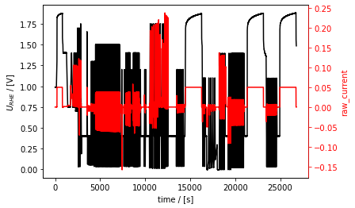

Here is a zoom-in on a section that includes all data from all three
sub-techniques (first CP, then OCP, then CVA):

.. code:: ipython3

    combined_meas.plot(tspan=[16000, 17000])

.. parsed-literal::

    [<AxesSubplot:xlabel='time / [s]', ylabel='$U_{RHE}$ / [V]'>,
     <AxesSubplot:ylabel='raw_current'>]

.. image:: tutorial_figures_diao/output_29_1.png

The individual measurement are accessible through the combined
measurement with it’s attribute ``component_measurements``:

.. code:: ipython3

    combined_meas.component_measurements

.. parsed-literal::

    [ECMeasurement(id=1, name='01_demo_02_OCV_C01.mpt'),
     ECMeasurement(id=2, name='01_demo_03_CVA_C01.mpt'),
     ECMeasurement(id=3, name='01_demo_04_CP_C01.mpt')]

If you need one of them out again, you can use indexing. In python,
indexing is done with square brackets and starts from ``0``, so indexing
with ``2`` gives you the third one. In the
``combined_meas.component_measurements`` list above, the third element
is the CP measurement:

.. code:: ipython3

    part = combined_meas.component_measurements[2]
    part

.. parsed-literal::

    ECMeasurement(id=3, name='01_demo_04_CP_C01.mpt')

This component measurement naturally still has all the ``ECMeasurement``
attributes like its plotter:

.. code:: ipython3

    part.plot_measurement(tspan=[14400, 17000])

.. parsed-literal::

    [<AxesSubplot:xlabel='time / [s]', ylabel='Ewe/V'>,
     <AxesSubplot:ylabel='I/mA'>]

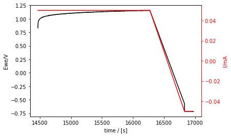

Saving to ixdat
---------------

``ixdat`` is built around a relational model of data, and provides a
backend that saves data in that structure. This is under development,
and for now is a folder on your computer. In the future it will be an
SQL database.

Right now, there aren’t really any advantages compared to exporting and
reading from text files. In the future it will provide all the power of
relational databases and SQL for organizing your experimental data. This
is under development. This part of the tutorial should therefore mainly
be considered a teaser.

The folder is present in your home directory in the folder ``ixdat``,
and a sub-folder defined by the ``project_name`` parameter (default is
“test”). To change the project name, use the ``change_database``
function of ``ixdat.db``. The first argument is the type of database and
for now can only be “directory”.

.. code:: ipython3

    from ixdat.db import change_database
    
    change_database("directory", project_name="21B19_demo")

Here, we show saving the measurement. First we give it a name to save
with, “extended_platinum_ec”, and then we save it with the ``save()``
method:

.. code:: ipython3

    combined_meas.name = "extended_platinum_ec"
    
    # save() returns a number, the id of the measurement, which we here name `m_id` for use later:
    m_id = combined_meas.save()  
    
    print(f"saved with id={m_id}")  # this kind of f-string is a nice way to print an object to the terminal

.. parsed-literal::

    saved with id=4
    

Take a quick look at what was saved in your ixdat/ folder.

To load a measurememt when you know it’s id (the only way implemented so
far), use ``Measurement.get()``:

.. code:: ipython3

    del(combined_meas)  # delete the original one to prove we're really loading
    
    loaded_meas = Measurement.get(m_id)  # load the saved measurement

And, let’s plot it to prove we loaded the same one.

Notice how fast it loaded, compared to reading the original files.
Notice also that the potential is still calibrated to the RHE scale, so
it includes metadata we added here using ``ixdat``

.. code:: ipython3

    loaded_meas.plot_measurement(
        tspan=[16000, 17000],  # A tspan of the measurement with all three sub-techniques: CP, OCP, and CVA.
    )

.. parsed-literal::

    [<AxesSubplot:xlabel='time / [s]', ylabel='$U_{RHE}$ / [V]'>,
     <AxesSubplot:ylabel='raw_current'>]

.. image:: tutorial_figures_diao/output_43_1.png

Selecting data and adjusting the starting time
----------------------------------------------

An annoying thing about the data plotted above is that the interesting
parts - the experiments - are many thousand seconds into the
measurement. It would be much nicer for thes experiments to start at 0.

Another annoying thing is that we have to keep telling it tspan for
plotting (``plot_measurement()``) and grabbing (``grab()``) data, even
if we’re really just interested in this one range.

Here we show how to select the range and redefine t=0.

First, selecting the range. This is done with the ``cut()`` method.
Here, we cut a part of the full measurement and call it ``co_strip``:

.. code:: ipython3

    co_strip = loaded_meas.cut(tspan=[13300, 13800])
    
    co_strip.plot_measurement()

.. parsed-literal::

    [<AxesSubplot:xlabel='time / [s]', ylabel='$U_{RHE}$ / [V]'>,
     <AxesSubplot:ylabel='<I>/mA'>]

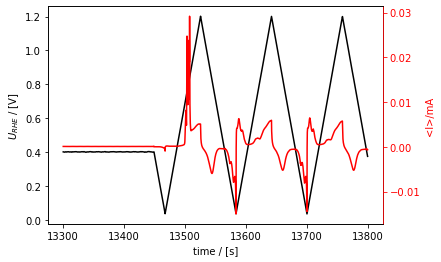

.. code:: ipython3

    t_0 = co_strip.t[0]
    print(f"the time starts at t={t_0}, which is annoying")

.. parsed-literal::

    the time starts at t=13300.05678509103, which is annoying
    

And now, to fix the start time, we just change the measurement’s
``tstamp``:

.. code:: ipython3

    co_strip.tstamp += co_strip.t[0]
    t_0 = co_strip.t[0]
    print(f"and now it starts at t={t_0}, which is nice!")
    
    co_strip.plot()

.. parsed-literal::

    and now it starts at t=0.0, which is nice!
    

.. parsed-literal::

    [<AxesSubplot:xlabel='time / [s]', ylabel='$U_{RHE}$ / [V]'>,
     <AxesSubplot:ylabel='<I>/mA'>]

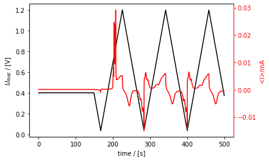

Here, we plot it again vs time (right subplot) to show that the time is
shifted. In this code block I also show how you can - use an Axis as an
argument, in order to get the subplots. - how to plot current vs
potential (``plot_vs_potential()``). - Also, how to save the figure.

.. code:: ipython3

    from matplotlib import pyplot as plt
    
    fig, [ax1, ax2] = plt.subplots(1, 2)
    fig.set_figwidth(fig.get_figheight()*2.5)
    
    co_strip.plot_measurement(
        axes=[ax2, ax2.twinx()], U_color="b", J_color="g"
    )
    
    co_strip.plot_vs_potential(ax=ax1)
    fig.savefig("01_cool_subplots.png")

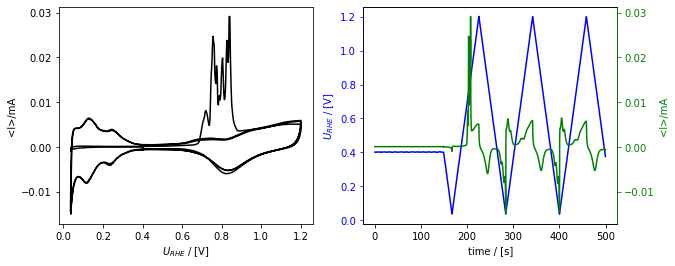

Here we select a second interesting section and change its tstamp in one
step using the ``t_zero`` argument to ``cut()``

.. code:: ipython3

    oxide_reduction = loaded_meas.cut(
        tspan=[16000, 17000], #t_zero="start"
    )
    
    oxide_reduction.plot_measurement()

.. parsed-literal::

    [<AxesSubplot:xlabel='time / [s]', ylabel='$U_{RHE}$ / [V]'>,
     <AxesSubplot:ylabel='raw_current'>]

.. image:: tutorial_figures_diao/output_52_1.png

Exporting
---------

Exporting is as simple as using a measurement’s ``export()`` method with
the desired file name. Here we export both interesting parts that we
selected above from the EC measurement:

.. code:: ipython3

    co_strip.export("./data/co_strip.csv")
    oxide_reduction.export("./data/oxide_reduction.csv")

The reader for the ixdat-exported files is “ixdat”. Here we show that
ixdat can read what it exports by reading and plotting one.

.. code:: ipython3

    loaded_from_export = Measurement.read("./data/co_strip.csv", reader="ixdat")
    loaded_from_export.plot()

.. parsed-literal::

    skipping the following line:
    ixdat version = 0.2.3
    
    skipping the following line:
    backend_name = BackendBase(none, address=none)
    
    

.. parsed-literal::

    [<AxesSubplot:xlabel='time / [s]', ylabel='$U_{RHE}$ / [V]'>,
     <AxesSubplot:ylabel='<I>/mA'>]

.. image:: tutorial_figures_diao/output_56_2.png

The end
-------

The files exported in this tutorial are used in the tutorial “**Tutorial
2: Comparing Cycles**”. See you there!

