.. _ec_tutorials:

=========================
Electrochemistry tutorial
=========================

Tutorial 2: Comparing cycles of a cyclic voltammagram
=====================================================

This tutorial, together with the previous one, shows ``ixdat``'s API for electrochemistry data.
It demonstrates, with CO stripping as an example, the following features:

- Selecting cyclic voltammatry cycles

- Integrating current to get charge passed

- Lining seperate cycles up with respect to potential

It reads ixdat-exported data directly from github.

Here we will show how to use ``ixdat`` and python to analyze two cases
where the difference in integrated current between two cycles in cyclic
voltammatry is needed.

Using the CO stripping example, we will show three ways of visualizing
the stripping experiment and determining the surface area of a platinum
electrode. Each gives the amount of charge associated with oxidation of
adsorbed CO, and thus an estimate of the electrochemical surface area of
the electrode. From most generalized to most automated, they are:

-  Finding the right timespans, getting the data as numpy vectors with
   ``grab()``, and integrating with ``trapz()``
-  Selecting the data with ``CyclicVoltammagram`` indexing and
   ``select_sweep()``, and integrating with ``integrate()``
-  Using ``subtract()`` to get a ``CyclicVoltammagramDiff`` object that
   does the analysis.

Then, you will, on your own, choose whichever method you like to
calculate the amount of charge associated with the reduction of an oxide
layer, which gives an estimate of the thickness of the oxide layer.

Setup
-----

We’ll use ``numpy`` and ``pathlib.Path`` as well as ``ixdat``\ ’s
``CyclicVoltammagram`` measurement type.

.. code:: ipython3

    import numpy as np
    from pathlib import Path
    
    from ixdat.techniques import CyclicVoltammogram

.. parsed-literal::

    importing ixdat v0.2.3 from C:\Users\MyUser\anaconda3\lib\site-packages\ixdat\__init__.py
    

Loading raw data
----------------

.. code:: ipython3

    # Below is An option to load from file. Today we will load from url
    # co_strip = CyclicVoltammagram.read(d"../loading_appending_and_saving/co_strip.csv", reader="ixdat")
    if True:  # Set this to False for offline work (requires you have downloaded the data file.)
        co_strip = CyclicVoltammogram.read_url(
            "https://raw.githubusercontent.com/ixdat/tutorials/main/electrochemistry/data/co_strip.csv",
            reader="ixdat"
        )
    else:
        co_strip = CyclicVoltammogram.read(
            "./data/co_strip.csv",
            reader="ixdat"
        )

.. parsed-literal::

    
    ----------  Importing EC_MS v0.7.5 ----------
    from C:\Users\MyUser\anaconda3\lib\site-packages\EC_MS\__init__.py
    
    
    wasnt able to evaluate '====='
    wasnt able to evaluate '====='
    wasnt able to evaluate '====='
    skipping the following line:
    ixdat version = 0.2.0dev
    
    skipping the following line:
    backend_name = BackendBase(none, address=none)
    
    

.. code:: ipython3

    co_strip.plot()

.. parsed-literal::

    <AxesSubplot:xlabel='$U_{RHE}$ / [V]', ylabel='<I>/mA'>

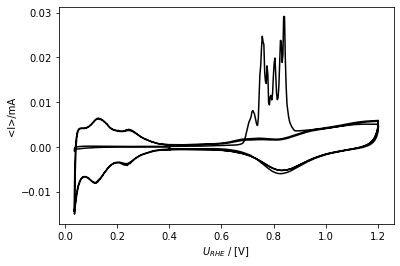

Selecting and calibrating
-------------------------

.. code:: ipython3

    co_strip.calibrate(
        # RE_vs_RHE=0.715,  # NOTE, the potential was already calibrated, 
                            # and recalibrating after exporting and reading
                            # causes problems in ixdat v0.2.0 :(
        A_el=0.196, 
        R_Ohm=100
    )
    help(co_strip.calibrate)

.. parsed-literal::

    Help on method calibrate in module ixdat.measurements:
    
    calibrate(*args, **kwargs) method of ixdat.techniques.cv.CyclicVoltammogram instance
        Add a calibration of the Measurement's default calibration type
        
        The calibration class is determined by the measurement's `technique`.
        *args and **kwargs are passed to the calibration class's `__init__`.
        
        Raises:
            TechniqueError if no calibration class for the measurement's technique
    
    

.. code:: ipython3

    co_strip.grab(co_strip.U_name)

.. parsed-literal::

    (array([  0.        ,   1.        ,   2.        , ..., 499.49669385,
            499.65079403, 499.80489397]),
     array([0.40165539, 0.40083473, 0.39980446, ..., 0.38106973, 0.37801271,
            0.37514458]))

.. code:: ipython3

    co_strip.plot_measurement()
    co_strip.plot()

.. parsed-literal::

    <AxesSubplot:xlabel='$U_{RHE}$ / [V] $_{ohm. corr.}$', ylabel='J / [mA cm$^{-2}$]'>

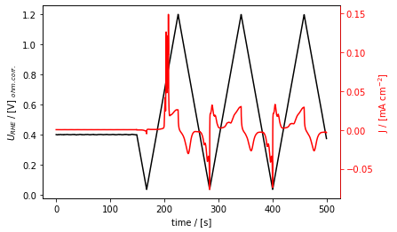

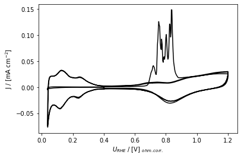

Method 1: ``grab()`` and ``np.trapz``
-------------------------------------

.. code:: ipython3

    co_strip.plot_measurement(tspan=[180, 220])
    co_strip.plot_measurement(tspan=[300, 340])

.. parsed-literal::

    [<AxesSubplot:xlabel='time / [s]', ylabel='$U_{RHE}$ / [V] $_{ohm. corr.}$'>,
     <AxesSubplot:ylabel='J / [mA cm$^{-2}$]'>]

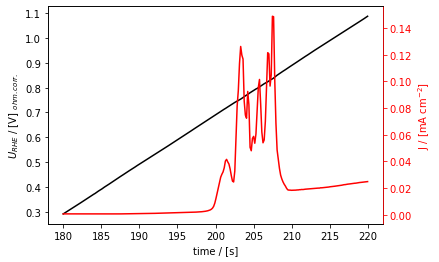

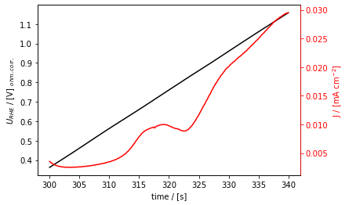

.. code:: ipython3

    tspan_strip = [195, 215]
    t_strip, I_strip = co_strip.grab("raw_current", tspan=tspan_strip)
    
    
    tspan_base = [310, 330]
    t_base, I_base = co_strip.grab("raw_current", tspan=tspan_base)

.. code:: ipython3

    print("got these vectors for the strip:")
    print(f"t/[s] = {t_strip} \nand \nI/[mA] = {I_strip}")
    print()
    print(f"they have these shapes: {t_strip.shape} and {I_strip.shape}")
    print()
    print(f"And for the base, the vectors have shapes: {t_base.shape} and {I_base.shape}")

.. parsed-literal::

    got these vectors for the strip:
    t/[s] = [195.11739755 195.27149773 195.42559767 195.57969761 195.73379755
     195.88789773 196.04199767 196.19609761 196.35019755 196.50429749
     196.65839767 196.81249762 196.96659756 197.1206975  197.27479768
     197.42889762 197.58299756 197.7370975  197.89119768 198.04529762
     198.19939756 198.35349751 198.50759768 198.66169763 198.81579757
     198.96989751 199.12399769 199.27809763 199.43219757 199.58629751
     199.74039745 199.89449763 200.04859757 200.20269752 200.35679746
     200.51089764 200.66499758 200.81909752 200.97319746 201.12729764
     201.28139758 201.43549752 201.58959746 201.74369764 201.89779758
     202.05189753 202.20599747 202.36009765 202.51419759 202.66829753
     202.82239747 202.97649741 203.13059759 203.28469753 203.43879747
     203.59289742 203.74699759 203.90109754 204.05529761 204.20929742
     204.3634975  204.51749754 204.67169762 204.82569742 204.9798975
     205.13389754 205.28809738 205.44209743 205.5962975  205.75029755
     205.90449739 206.05849743 206.21269751 206.36669755 206.52089739
     206.67489743 206.82909751 206.98309755 207.13729739 207.29129744
     207.44549751 207.59949756 207.7536974  207.90769744 208.06189752
     208.21589756 208.3700974  208.52409744 208.67829752 208.83229756
     208.9864974  209.14049745 209.29469752 209.44869757 209.60289741
     209.75689745 209.91109753 210.06509733 210.21929741 210.37329745
     210.52749753 210.68149734 210.83569741 210.98979735 211.14389753
     211.29799747 211.45209742 211.60619736 211.76029754 211.91439748
     212.06849742 212.22259736 212.3766973  212.53079748 212.68489742
     212.83899736 212.99309731 213.14719748 213.30129743 213.45539737
     213.60949731 213.76359749 213.91769743 214.07179737 214.22589731
     214.37999749 214.53409743 214.68819737 214.84229732 214.9963975 ] 
    and 
    I/[mA] = [0.00029328 0.00029863 0.0003056  0.00030855 0.00031173 0.00031905
     0.00032301 0.00032645 0.00033343 0.00034102 0.00034388 0.00034984
     0.00035995 0.00036629 0.0003718  0.0003836  0.00039228 0.00040075
     0.00041476 0.00042947 0.00044306 0.00046112 0.00048421 0.00050812
     0.00053865 0.00057995 0.00063175 0.00069877 0.00080024 0.00095775
     0.00122753 0.00171086 0.00241396 0.00320765 0.00400408 0.00482864
     0.00551815 0.0059437  0.00628901 0.00688835 0.0078873  0.00813825
     0.00775796 0.00745258 0.00673803 0.00577352 0.00494863 0.00480672
     0.00642391 0.01105442 0.015974   0.01828982 0.02221775 0.02472684
     0.02345115 0.02287854 0.01666988 0.01464315 0.01418325 0.01811977
     0.01616298 0.00990621 0.00939982 0.01120861 0.01151347 0.01050372
     0.01188029 0.01532736 0.01868608 0.0198799  0.01629252 0.01215194
     0.01057014 0.01099351 0.01372425 0.01875543 0.02380865 0.02363272
     0.01890809 0.02055336 0.02916847 0.029096   0.0198015  0.01346152
     0.00950942 0.00812947 0.00680537 0.00581626 0.00525828 0.00483008
     0.00449103 0.00422481 0.00390258 0.00366777 0.00361393 0.00361808
     0.00358995 0.00359514 0.00360841 0.00360258 0.00361546 0.00364085
     0.00364237 0.00367725 0.00368028 0.003709   0.00369773 0.0037285
     0.0037514  0.00376652 0.00377703 0.00380757 0.00380812 0.00381768
     0.00384515 0.00385362 0.00388399 0.00389525 0.00390544 0.00391151
     0.00391097 0.0039572  0.00395626 0.00397375 0.00400601 0.00401037
     0.00402053 0.00405869 0.00406987 0.00410532]
    
    they have these shapes: (130,) and (130,)
    
    And for the base, the vectors have shapes: (130,) and (130,)
    

**Checking what we’ve got**

.. code:: ipython3

    from matplotlib import pyplot as plt
    
    fig, ax1 = plt.subplots()
    ax1.plot(t_strip, I_strip)
    ax1.set_xlabel("time / [s]")
    ax1.set_ylabel("current / [mA]")
    ax1.set_title("stripping current")

.. parsed-literal::

    Text(0.5, 1.0, 'stripping current')

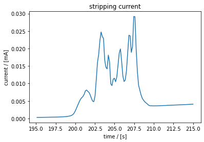

.. code:: ipython3

    fig, ax2 = plt.subplots()
    ax2.plot(t_base, I_base, label="base")
    ax2.plot(t_strip, I_strip, label="strip")
    ax2.legend()
    ax2.set_xlabel("time / [s]")
    ax2.set_ylabel("current / [mA]")
    ax2.set_title("strip and base current vs time")

.. parsed-literal::

    Text(0.5, 1.0, 'strip and base current vs time')

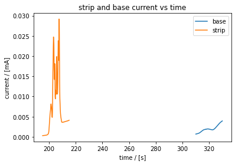

.. code:: ipython3

    v_strip = co_strip.grab_for_t("potential", t_strip)
    v_base = co_strip.grab_for_t("potential", t_base)
    
    fig, ax = plt.subplots()
    ax.plot(v_base, I_base, color="k", label="base")
    ax.plot(v_strip, I_strip, color="g", label="strip")
    ax.legend()
    ax.set_xlabel("potential / [V]")
    ax.set_ylabel("current / [mA]")

.. parsed-literal::

    Text(0, 0.5, 'current / [mA]')

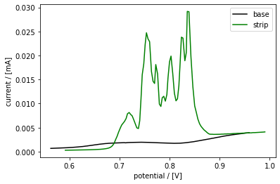

.. code:: ipython3

    tspan_base = [311.5, 331.5]
    t_base, I_base = co_strip.grab("raw_current", tspan=tspan_base)
    v_base = co_strip.grab_for_t("potential", t_base)
    
    
    fig, ax = plt.subplots()
    ax.plot(v_base, I_base, color="k", label="base")
    ax.plot(v_strip, I_strip, color="g", label="strip")
    ax.legend()
    ax.set_xlabel(co_strip.U_name)
    ax.set_ylabel("current / [mA]")

.. parsed-literal::

    Text(0, 0.5, 'current / [mA]')

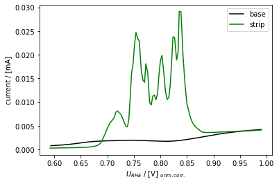

**And do the integration!**

.. code:: ipython3

    Q_strip = np.trapz(I_strip, t_strip) * 1e-3  # converts mC --> C
    
    Q_base = np.trapz(I_base, t_base) * 1e-3
    
    Q_CO_ox = Q_strip - Q_base
    
    from ixdat.constants import FARADAY_CONSTANT
    
    
    #  CO + H2O --> CO2  + 2(H+ + e-)
    n_CO_ox = Q_CO_ox / (FARADAY_CONSTANT * 2)
    
    print(f"charge passed = {Q_CO_ox*1e6} uC, corresponding to {n_CO_ox*1e9} nmol of CO oxidized")
    

.. parsed-literal::

    charge passed = 94.95604644970163 uC, corresponding to 0.49207503544863207 nmol of CO oxidized
    

Method 2: Sweep selection and ``integrate()``
---------------------------------------------

.. code:: ipython3

    co_strip.plot_measurement(
        J_name="cycle"
    )

.. parsed-literal::

    [<AxesSubplot:xlabel='time / [s]', ylabel='$U_{RHE}$ / [V] $_{ohm. corr.}$'>,
     <AxesSubplot:ylabel='cycle'>]

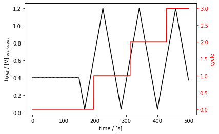

.. code:: ipython3

    co_strip.redefine_cycle(start_potential=0.3, redox=False)
    co_strip.plot_measurement(J_name="cycle")

.. parsed-literal::

    [<AxesSubplot:xlabel='time / [s]', ylabel='$U_{RHE}$ / [V] $_{ohm. corr.}$'>,
     <AxesSubplot:ylabel='cycle'>]

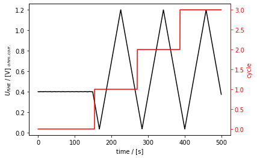

.. code:: ipython3

    co_strip[1].plot()

.. parsed-literal::

    <AxesSubplot:xlabel='$U_{RHE}$ / [V] $_{ohm. corr.}$', ylabel='J / [mA cm$^{-2}$]'>

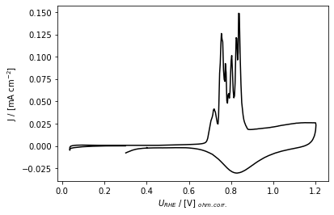

The code below selects two cycles from the CO stripping experiment.

The code in the next bloc calculates the amount of CO according to:

$n_{CO} = :raw-latex:`\frac{1}{2 \mathcal{F}}` :raw-latex:`\int`\ *{0.6
V*\ {RHE}}^{1.0 V_{RHE}} ( I_{strip} - I_{base} )
:raw-latex:`\mathrm{d}`t $

.. code:: ipython3

    stripping_cycle = co_strip[1]
    base_cycle = co_strip[2]
    
    ax = stripping_cycle.plot(color="green", label="strip")
    base_cycle.plot(ax=ax, color="black", label="base")
    
    ax.legend()
    
    ax.get_figure().tight_layout()
    
    ax.get_figure().savefig("02_two_cycles.png")

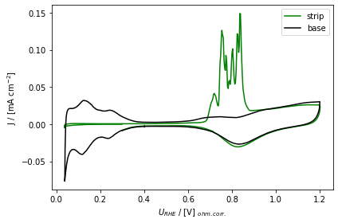

.. code:: ipython3

    vspan = [0.6, 1.0]
    
    stripping_sweep = stripping_cycle.select_sweep(vspan=vspan)
    base_sweep = base_cycle.select_sweep(vspan=vspan)
    
    stripping_sweep  # to show what you get from this

.. parsed-literal::

    CyclicVoltammogram(id=5, name='temp.csv')

.. code:: ipython3

    ax = stripping_sweep.plot(color="g")
    base_sweep.plot(color="k", ax=ax)

.. parsed-literal::

    <AxesSubplot:xlabel='$U_{RHE}$ / [V] $_{ohm. corr.}$', ylabel='J / [mA cm$^{-2}$]'>

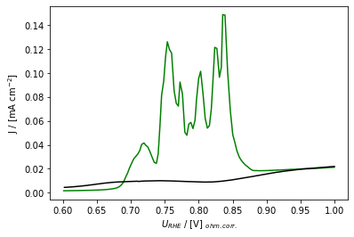

.. code:: ipython3

    Q_strip = stripping_sweep.integrate("raw_current", ax="new") * 1e-3
    Q_base = base_sweep.integrate("raw_current", ax="new") * 1e-3
    
    Q_CO_ox = Q_strip - Q_base
    n_CO_ox = Q_CO_ox / (FARADAY_CONSTANT * 2)
    
    print(f"charge passed = {Q_CO_ox*1e6} uC, corresponding to {n_CO_ox*1e9} nmol of CO oxidized")

.. parsed-literal::

    charge passed = 95.14178417627072 uC, corresponding to 0.49303755339038363 nmol of CO oxidized
    

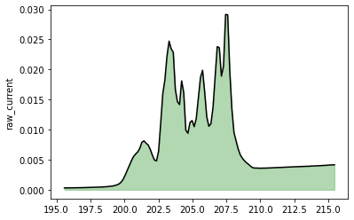

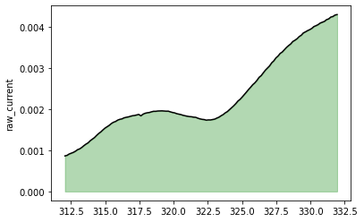

Method 3: ``CyclicVoltammagramDiff``
------------------------------------

.. code:: ipython3

    stripping_cycle = co_strip[1]
    base_cycle = co_strip[2]
    
    ax = stripping_cycle.plot(color="g")
    base_cycle.plot(ax=ax, color="k")

.. parsed-literal::

    <AxesSubplot:xlabel='$U_{RHE}$ / [V] $_{ohm. corr.}$', ylabel='J / [mA cm$^{-2}$]'>

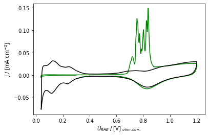

.. code:: ipython3

    cv_diff = stripping_cycle.diff_with(base_cycle)
    
    cv_diff.plot()

.. parsed-literal::

    C:\Users\MyUser\anaconda3\lib\site-packages\ixdat\techniques\analysis_tools.py:92: RuntimeWarning: invalid value encountered in divide
      v_scan_behind = (v - v_behind) / (t - t_behind)
    C:\Users\MyUser\anaconda3\lib\site-packages\ixdat\techniques\analysis_tools.py:93: RuntimeWarning: invalid value encountered in divide
      v_scan_ahead = (v_ahead - v) / (t_ahead - t)
    C:\Users\MyUser\anaconda3\lib\site-packages\ixdat\techniques\analysis_tools.py:92: RuntimeWarning: invalid value encountered in divide
      v_scan_behind = (v - v_behind) / (t - t_behind)
    C:\Users\MyUser\anaconda3\lib\site-packages\ixdat\techniques\analysis_tools.py:93: RuntimeWarning: invalid value encountered in divide
      v_scan_ahead = (v_ahead - v) / (t_ahead - t)
    

.. parsed-literal::

    <AxesSubplot:xlabel='$U_{RHE}$ / [V] $_{ohm. corr.}$', ylabel='J / [mA cm$^{-2}$]'>

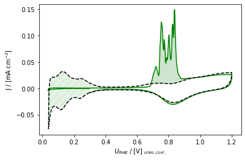

.. code:: ipython3

    cv_diff.plot_diff()

.. parsed-literal::

    <AxesSubplot:>

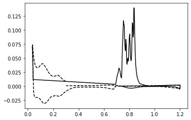

.. code:: ipython3

    cv_diff.plot_measurement()

.. parsed-literal::

    [<AxesSubplot:xlabel='time / [s]', ylabel='$U_{RHE}$ / [V] $_{ohm. corr.}$'>,
     <AxesSubplot:ylabel='J / [mA cm$^{-2}$]'>]

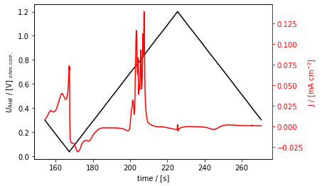

.. code:: ipython3

    Q_CO_ox = cv_diff.integrate("raw_current", vspan=[0.6, 1.0]) * 1e-3  # 1e-3 converts mC --> C
    n_CO_ox = Q_CO_ox / (FARADAY_CONSTANT * 2)
    
    print(f"charge passed = {Q_CO_ox*1e6} uC, corresponding to {n_CO_ox*1e9} nmol of CO oxidized")

.. parsed-literal::

    charge passed = 95.08391830687209 uC, corresponding to 0.49273768465321294 nmol of CO oxidized
    

Your turn!
==========

.. code:: ipython3

    # oxide_reduction = CyclicVoltammagram.read(data_directory / "oxide_reduction.csv", reader="ixdat")
    if True:  # Set this to False for offline work (requires you have downloaded the data file.)
        oxide_reduction = CyclicVoltammogram.read_url(
            "https://raw.githubusercontent.com/ixdat/tutorials/main/electrochemistry/data/oxide_reduction.csv",
            reader="ixdat"
        )
    else:
        oxide_reduction = CyclicVoltammogram.read(
            "./data/oxide_reduction.csv", reader="ixdat"
        )
        
    oxide_reduction.calibrate(A_el=0.196, R_Ohm=100)
    
    oxide_reduction.tstamp += oxide_reduction.t[0]
    oxide_reduction.plot_measurement()
    oxide_reduction.plot(tspan=[300, 800])

.. parsed-literal::

    skipping the following line:
    ixdat version = 0.2.0dev
    
    skipping the following line:
    backend_name = BackendBase(none, address=none)
    
    

.. parsed-literal::

    <AxesSubplot:xlabel='$U_{RHE}$ / [V] $_{ohm. corr.}$', ylabel='J / [mA cm$^{-2}$]'>

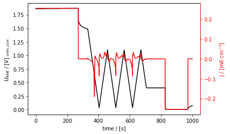

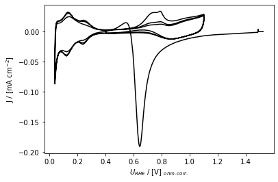

