.. _ecms_tutorial:

=============================================
Electrochemistry - Mass spectrometry tutorial
=============================================

This tutorial is to show the most advanced tools to date for ixdat
analysis of EC-MS data.

It is based on the data analysis done for Spectro Inlets Application
Note #2 - Quantification

There are three parts:

-  Importing, plotting and exporting data
-  Analyzing EC-MS calibrations
-  Using EC-MS calibrations

Importing, plotting, and exporting
==================================

First, we import and plot the dataset we would like to calibrate.

.. code:: ipython3

    from ixdat import Measurement
    
    meas = Measurement.read(r"./HER and OER/2022-07-19 10_02_32 AIO_HER_OER_2021bW2D3.tsv", reader="zilien")
    
    meas.plot()

.. parsed-literal::

    importing ixdat v0.2.5 from C:\Users\AnnaWiniwarter\anaconda3\lib\site-packages\ixdat\__init__.py
    
    ----------  Importing EC_MS v0.7.5 ----------
    from C:\Users\AnnaWiniwarter\anaconda3\lib\site-packages\EC_MS\__init__.py
    
    
    wasnt able to evaluate '====='
    wasnt able to evaluate '====='
    wasnt able to evaluate '====='
    

.. parsed-literal::

    [<AxesSubplot:xlabel='time / [s]', ylabel='signal / [A]'>,
     <AxesSubplot:xlabel='time / [s]', ylabel='Voltage [V]'>,
     None,
     <AxesSubplot:ylabel='Current [mA]'>]

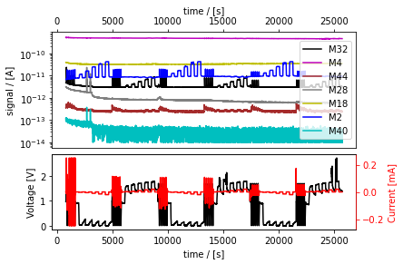

That was a lot. Let’s zoom in on an interesting part.

Tip: if you’re using a backend for matplotlib that returns scalable
plots (not Jupyter notebooks), you can easily zoom into your plot to
find the timestamps at start and end of the part you find interesting. A
left mouse click into the plot will print the time where the mouse is
pointing to. A right click at a different point following a left click
will print the start and end as well as length of the timespan in
between.

.. code:: ipython3

    meas.plot(tspan=[5000, 5750])
    
    # help(meas.plot)  # This shows a full list of customization arguments to the plot function

.. parsed-literal::

    [<AxesSubplot:xlabel='time / [s]', ylabel='signal / [A]'>,
     <AxesSubplot:xlabel='time / [s]', ylabel='Voltage [V]'>,
     None,
     <AxesSubplot:ylabel='Current [mA]'>]

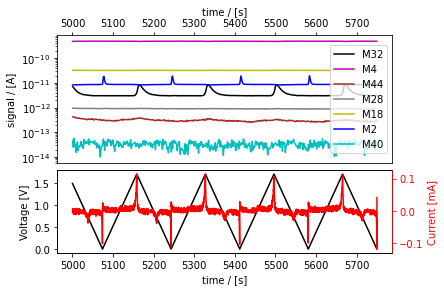

The EC data looks a bit noisy - let’s use the EC data as saved by ECLab
here instead. First we import the MS data only from the Zilien data
file:

Note, if you use Zilien vs. 2.6.0 or higher, Zilien will export the same
data as saved by ECLab, so this will no longer be necessary.

.. code:: ipython3

    ms_meas = Measurement.read(r"./HER and OER/2022-07-19 10_02_32 AIO_HER_OER_2021bW2D3.tsv", reader="zilien", technique="MS")
    ms_meas.replace_series("Ewe/V", None)
    ms_meas.replace_series("I/mA", None)

Then we import the electrochemistry data from the text files exported by
ECLab:

.. code:: ipython3

    cvs_her_meas = Measurement.read(r"./HER and OER/2022-07-19 10_02_32 AIO_HER_OER_2021bW2D3_01_01_CVA_DUSB0_C01.mpt", reader="biologic")
    cps_her_meas = Measurement.read(r"./HER and OER/2022-07-19 10_02_32 AIO_HER_OER_2021bW2D3_01_02_CP_DUSB0_C01.mpt", reader="biologic")
    cvs_oer_meas = Measurement.read(r"./HER and OER/2022-07-19 10_02_32 AIO_HER_OER_2021bW2D3_01_03_CVA_DUSB0_C01.mpt", reader="biologic")
    cps_oer_meas = Measurement.read(r"./HER and OER/2022-07-19 10_02_32 AIO_HER_OER_2021bW2D3_01_04_CP_DUSB0_C01.mpt", reader="biologic")

And combine everything:

.. code:: ipython3

    meas_combi = ms_meas + cvs_her_meas + cps_her_meas + cvs_oer_meas + cps_oer_meas
    
    meas_combi.plot()
    meas_combi.plot(tspan=[5000, 5750])

.. parsed-literal::

    [<AxesSubplot:xlabel='time / [s]', ylabel='signal / [A]'>,
     <AxesSubplot:xlabel='time / [s]', ylabel='Ewe/V'>,
     None,
     <AxesSubplot:ylabel='raw_current'>]

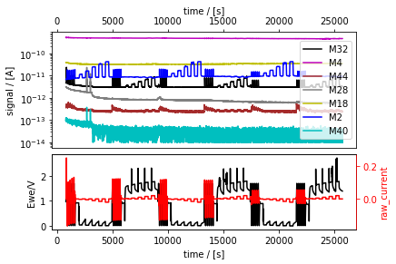

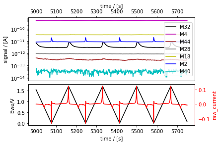

Now that looks better! Let’s export that bit so we can share it with
someone without exceeding an attachment limit:

.. code:: ipython3

    meas_part = meas_combi.cut(tspan=[5000, 5750])
    meas_part.export("the_good_bit.csv")

ixdat can of course read the files it exports:

.. code:: ipython3

    meas_loaded = Measurement.read("the_good_bit.csv", reader="ixdat")
    
    meas_loaded.plot()

.. parsed-literal::

    skipping the following line:
    ixdat version = 0.2.5
    
    skipping the following line:
    backend_name = BackendBase(none, address=none)
    
    

.. parsed-literal::

    [<AxesSubplot:xlabel='time / [s]', ylabel='signal / [A]'>,
     <AxesSubplot:xlabel='time / [s]', ylabel='Ewe/V'>,
     None,
     <AxesSubplot:ylabel='<I>/mA'>]

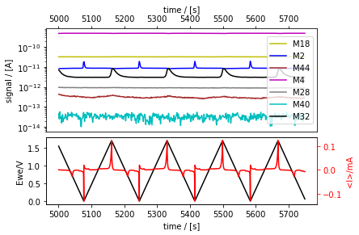

Calibrations
============

EC-MS calibration
-----------------

Now, we analyze EC-MS calibration measurements. The code is taken from
here:

https://github.com/ScottSoren/pyCOox_public/blob/main/paper_I_fig_S1/paper_I_fig_S1.py

We know the geometric area of the electrode, so we can normalize the
current: it’s a 5mm diameter disk, area = 0.196 cm^2 We used an RHE
reference electrode, so we assume that the potential difference between
our reference electrode and the RHE potential is zero. We did not
determine the Ohmic drop, but we will assume that it was 0 (even though
that is not entirely correct), to demonstrate how we can calibrate for
it.

.. code:: ipython3

    meas.calibrate(RE_vs_RHE=0, A_el=0.196, R_Ohm=0)
    # select the first hydrogen calibration and plot with calibrated EC data
    meas.plot(tspan=[0,4900])

.. parsed-literal::

    [<AxesSubplot:xlabel='time / [s]', ylabel='signal / [A]'>,
     <AxesSubplot:xlabel='time / [s]', ylabel='$U_{RHE}$ / [V] $_{ohm. corr.}$'>,
     None,
     <AxesSubplot:ylabel='J / [mA cm$^{-2}$]'>]

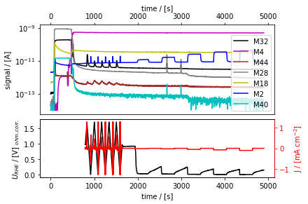

There is some data here before the hydrogen calibration measurement
starts; let’s shift t=0 to the right, to when the CPs start. Note that
if you re-run this part, the time will be shifted further every time.
Outcomment it if you do not want to move the start further.

.. code:: ipython3

    meas.tstamp += 1700

The raw data is easily plotted with the plot_measurement function, which
doesn’t only create a figure, but also returns a list of three axes for
(i) ms, (ii) potential, and (iii) current. See
``help(meas.plot_measurement)`` for customization.

We will be adding to these axes later to indicate the timespans used for
the calibrations.

.. code:: ipython3

    axes_a = meas.plot_measurement(tspan=(0, 3200))

.. image:: EC-MS_ixdat_tutorial_files/EC-MS_ixdat_tutorial_21_0.png

Now, this is a standard EC-MS plot, which is in itself not bad. Still,
sometimes one might like to change something about it, let’s say the
size of the axis labels, the position of the legend, or the dimensions
of the figure. To do this, we can name the figure by getting it via the
first axis, which then allows us to modify the plot like any regular
matplotlib plot. This only works if the plot has not been printed yet,
so we need to define ``axes_a`` again at the beginning. Let’s make the
plot wider, as an example:

.. code:: ipython3

    axes_a = meas.plot_measurement(tspan=(0, 3200))
    fig_a = axes_a[0].get_figure()  # name the figure by getting it via the first axis.
    fig_a.set_figwidth(
        fig_a.get_figwidth() * 2.5
    )  # make it 2.5 times as wide as it is tall

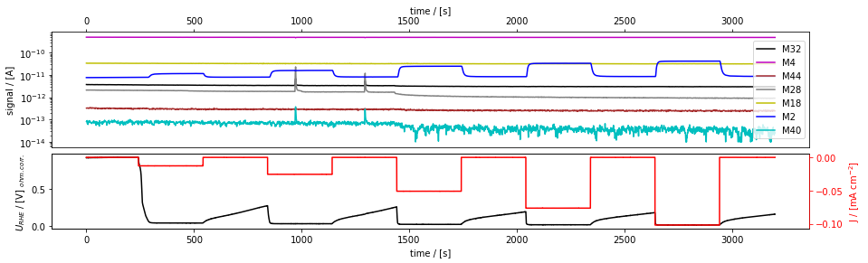

Great! Now we’re ready to use this data to calibrate for H2 at m/z=2.
For this we use the ixdat method ``ecms_calibration_curve``, which
automatically selects and integrates M2 signal and electrochemical
current in the given timespans.

.. code:: ipython3

    # redefine this axis, so we can use it here (since Jupyter doesn't update already printed plots).
    axes_a = meas.plot_measurement(tspan=(0, 3200)) 
    # calculate the calibration factor
    cal_result_H2, ax_b = meas.ecms_calibration_curve(
        mol="H2",
        mass="M2",
        n_el=-2, # remember to use the correct sign: minus for reduction reactions, plus for oxidation reactions
        tspan_list=[(450, 500), (1000, 1050), (1550, 1600), (2200, 2250), (2750, 2800)],  # timespans of H2 evolution
        tspan_bg=(0, 100),
        ax="new",
        axes_measurement=axes_a, # to highlight the integrated areas on the plot defined above
        return_ax = True # if True, returns the calibration curve axis as a second element
    ) 
    # NOTE, it uses and highlights the electrochemical current, not the calculated current density - FIXME!!

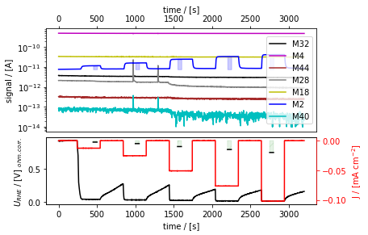

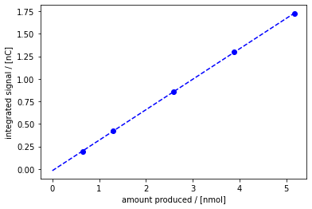

Because we asked for ``return_ax``, two arguments are returned: The
first, which we call ``cal_result_H2``, is a ``MSCalResult`` for H2. The
second, which we call ``ax_H2``, is the axis where it plots the
calibration curve. As we asked for ``axes_measurement``, to be plotted
on ``axes_a``, the areas that were integrated are highlighted on that
axes.

The attribute ``cal_result_H2.F`` is the slope of the calibration curve,
which is the sensitivity factor in C/mol. (Note that this
calibration_curve works with integrals rather than simply the rates. The
latter is not yet implemented in ixdat.)

.. code:: ipython3

    print(cal_result_H2)  # prints: MSCalResult(name="H2@M2", mol="H2", mass="M2", F=0.34)
    
    # This is the first of several MSCalResults, which we will collect in this list:
    cal_results = [cal_result_H2]
    
    # save the figure:
    fig_b = ax_b.get_figure()
    fig_b.savefig("hydrogen_calibration.png")  # you can use eg .svg instead for vector graphics.

.. parsed-literal::

    MSCalResult(name=H2@M2, mol=H2, mass=M2, F=0.3378605863775754)
    

Tip: instead of selecting the time spans manually, you can also use the
option of passing a ``selector_name (str)`` (Name of selector which
identifies the periods of steady electrolysis for automatic selection of
timespans of steady electrolysis. E.g. ``"selector"`` or ``"Ns"`` for
biologic EC data) and a ``selector_list`` instead of the ``tspan_list``.
Note that you need to have information on the different parts of the EC
data in your measurement data to take advanatge of this. If you used a
Zilien version < 2.6.0 when running the measurement, this requires that
you import the EC data from the ECLab. Here, we can use the data
imported to ``meas_combi``.

First, let’s figure out what we should pass to selector list. To this
end, we can plot the selector we want to use in our regular EC-MS plot,
for example instead of the current:

.. code:: ipython3

    axes_a2 = meas_combi.plot_measurement(tspan=(0, 4700), J_name="selector")

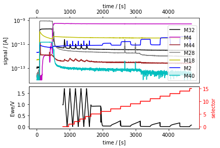

.. code:: ipython3

    # redefine this axis, so we can use it here (since Jupyter doesn't update already printed plots).
    axes_a2 = meas_combi.plot_measurement(tspan=(1900, 4700))
    # calculate the calibration factor
    cal_result_H2_selector, ax_b2 = meas_combi.ecms_calibration_curve(
        mol="H2",
        mass="M2",
        n_el=-2, # remember to use the correct sign: minus for reduction reactions, plus for oxidation reactions
        selector_name="selector",
        selector_list=[6,8,10,12,14],  # sections of H2 evolution
        tspan_bg=(1800, 1900),
        ax="new",
        axes_measurement=axes_a2, # to highlight the integrated areas on the plot defined above
        return_ax = True # if True, returns the calibration curve axis as a second element
    )
    print(cal_result_H2)  # prints: MSCalResult(name="H2@M2", mol="H2", mass="M2", F=0.34)

.. parsed-literal::

    Following tspans were selected for calibration: [[1945.0643708705902, 2245.06396317482], [2545.064355611801, 2845.0639481544495], [3145.0643405914307, 3445.0639328956604], [3745.0643253326416, 4045.06391787529], [4345.0643100738525, 4645.063902616501]]
    MSCalResult(name=H2@M2, mol=H2, mass=M2, F=0.3378605863775754)
    

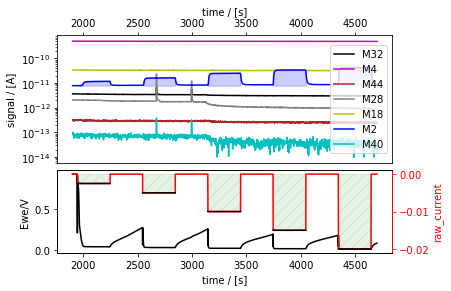

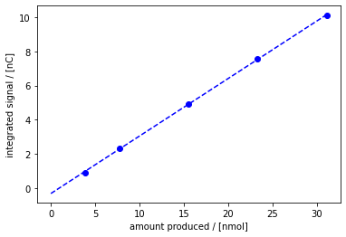

Now, let’s do the same for oxygen. First, let’s find the right section
of the measurement and plot it, so we can find the ``tspan``.

.. code:: ipython3

    meas.plot(tspan=[4100,7400])

.. parsed-literal::

    [<AxesSubplot:xlabel='time / [s]', ylabel='signal / [A]'>,
     <AxesSubplot:xlabel='time / [s]', ylabel='$U_{RHE}$ / [V] $_{ohm. corr.}$'>,
     None,
     <AxesSubplot:ylabel='J / [mA cm$^{-2}$]'>]

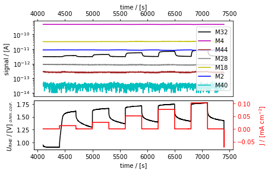

.. code:: ipython3

    # let's define an axes variable, so we can use it to plot the integrated areas.
    axes_c = meas_combi.plot_measurement(tspan=(4100, 7400)) 
    # calculate the calibration factor
    cal_result_O2, ax_d= meas_combi.ecms_calibration_curve(
        mol="O2",
        mass="M32",
        n_el=4, # remember to use the correct sign: minus for reduction reactions, plus for oxidation reactions
        tspan_list=[(4550, 4600), (5200, 5250), (5750, 5800), (6395, 6445), (6950, 7000)],  # timespans of O2 evolution
        tspan_bg=(4150, 4250),
        ax="new",
        axes_measurement=axes_c, # to highlight the integrated areas on the plot defined above
        return_ax = True # if True, returns the calibration curve axis as a second element
    )

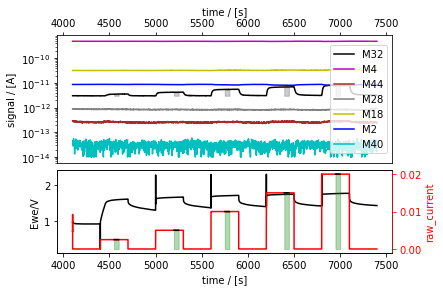

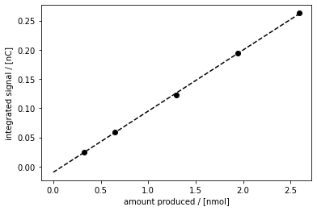

.. code:: ipython3

    print(cal_result_O2)  # prints: MSCalResult(name="O2@M32", mol="O2", mass="M32", F=0.10)
    
    # Let's add this to our list of MSCalResult objects:
    cal_results.append(cal_result_O2)
    
    # save the figure:
    fig_d = ax_d.get_figure()
    fig_d.savefig("oxygen_calibration.png")  # you can use eg .svg instead for vector graphics.

.. parsed-literal::

    MSCalResult(name=O2@M32, mol=O2, mass=M32, F=0.01182634523322349)
    

Congratulations! We have now calibrated for hydrogen and oxygen, using
electrochemical calibration. However, this approach limits our
calibration to those products that we can produce electrochemically with
close to 100% faradaic efficiency. Instead, we can take advantage of the
gas system of the EC-MS and directly introduce calibration gases to the
chip.

Gas calibration
---------------

Let’s first do this for hydrogen and oxygen to compare with the results
from the electrochemical gas calibration.

First we need to import the data, of course. The Zilien datafile doesn’t
contain any EC data in this case, which confuses the reader - we
therefore specify ``technique="MS"``.

.. code:: ipython3

    meas_gascal_H2 = Measurement.read(r"./gas cal high H2/2022-07-20 11_24_43 AIO_high_H2_2021bW2D3.tsv", reader="zilien", 
                                     technique="MS")
    
    meas_gascal_H2.plot()
    # We don't need the first 1500s of the measurement, where the signals fluctuate a bit while pumping and flushing the gas lines
    meas_gascal_H2 = meas_gascal_H2.cut(tspan=[1500, 6000])
    meas_gascal_H2.plot()

.. parsed-literal::

    <AxesSubplot:xlabel='time / [s]', ylabel='signal / [A]'>

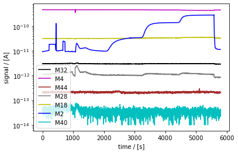

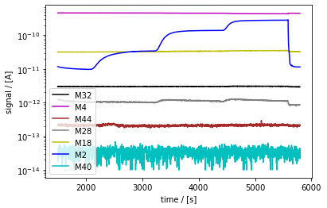

Now, the gas calibration works a bit differently than the EC-MS
calibration, as it relies on knowing the flux of molecules into the MS
for the inlet used. Therefore, the calibration is not done for a
specific measurement, but rather for an ``MSInlet`` object, which
requires a slightly different sytnax.

Let’s first define the inlet object: ``ixdat``\ ’s default MS inlet is a
Spectro Inlets EC-MS chip. The chip object contains information about
the inlet, such as it’s dimensions, the temperature and pressure, as
well as functions for calculating the molar flux of a pure gas (the
carrier gas) to the capillary, and for using this flux to calculate a
sensitivity factor.

(In principle, the chip’s capillary size should be calibrated, but this
usually only changes the results by a few percent, and is not yet
implemented in ixdat.)

.. code:: ipython3

    from ixdat.techniques.ms import MSInlet
    
    chip = MSInlet() 
    # chip = MSInlet(T=300, p=20000) #optional: select T (in Kelvin) and p (in Pa); will use 298.15 K and 10000 Pa if not specified

Now we can use the method ``gas_flux_calibration_curve`` to do a gas
calibration. Note, this method relies on the calculation of the flux of
the carrier gas through the capillary and assumes that this flux will
not be affected by the change in gas composition due to the analytes.
This assumption likely holds as long as the gas concentration is <10%
(better <1%), but is ideally only used for small analyte concentrations.
A new, more powerful method is in development and will be introduced in
a separate tutorial soon.

.. code:: ipython3

    axes_e = meas_gascal_H2.plot_measurement()
    
    cal_H2_2, ax_f = chip.gas_flux_calibration_curve(
        measurement=meas_gascal_H2,  # the measurement with the calibration data
        mol="H2",  # the molecule to calibrate
        mass="M2",  # the mass to calibrate at
        tspan_list=[
            [2900, 3100],
            [4200, 4400],
            [5200, 5500],
             ], # the timespans to average the signal over
        carrier_mol="He", # the molecule that is used to calculate the total flux through the capillary
        mol_conc_ppm=[10000, 50000, 100000], # the concentration of the analyte at the timespans given above in ppm
        tspan_bg=[1900, 2000], # the timespan for background subtraction (optional)
        return_ax=True, # whether to return the calibration curve
        #axes_measurement=axes_e # the axis on which to indicate what signal is used with a thicker line  
        #-> this introduces an error into the data analysis (defines that mol_conc_ppm = 10^6) FIXME!! 
    )
    
    cal_H2_2.name = "H2_M2_gas"  # so that it doesn't clash with the EC-MS calibration.
    
    # add these gas calibrations to the list:
    print(cal_H2_2) 
    cal_results.append(cal_H2_2)

.. parsed-literal::

    MSCalResult(name=H2_M2_gas, mol=H2, mass=M2, F=0.3191356304426369)
    

.. image:: EC-MS_ixdat_tutorial_files/EC-MS_ixdat_tutorial_40_1.png

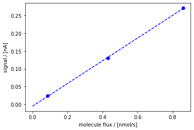

Great! Now that we know how to do this, we can also do it for our oxygen
and ethylene calibrations.

.. code:: ipython3

    #oxygen
    meas_gascal_O2 = Measurement.read(r"./gas cal O2/2022-07-20 15_32_25 AIO_O2_2021bW2D3.tsv", reader="zilien", 
                                     technique="MS")
    
    axes_g = meas_gascal_O2.plot_measurement()
    
    cal_O2_2, ax_h = chip.gas_flux_calibration_curve(
        measurement=meas_gascal_O2,  # the measurement with the calibration data
        mol="O2",  # the molecule to calibrate
        mass="M32",  # the mass to calibrate at
        tspan_list=[
            [2200, 2300],
            [3500, 3600],
            [4900, 5000],
            [6100, 6200],
            [7300, 7400],
             ], # the timespans to average the signal over
        carrier_mol="He", # the molecule that is used to calculate the total flux through the capillary
        mol_conc_ppm= [5000, 10000, 20000, 50000, 100000], # the concentration of the analyte at the timespans given above in ppm
        tspan_bg=[900, 1000], # the timespan for background subtraction (optional)
        return_ax=True, # whether to return the calibration curve
        #axes_measurement=axes_g # the axis on which to indicate what signal is used with a thicker line  
        #-> this introduces an error into the data analysis (defines that mol_conc_ppm = 10^6) FIXME!! 
    )
    cal_O2_2.name = "O2_M32_gas"  # so that it doesn't clash with the EC-MS calibration.
    print(cal_O2_2) 
    
    #ethylene
    meas_gascal_C2H4 = Measurement.read(r"./gas cal C2H4/2022-07-20 13_04_48 AIO_C2H4_2021bW2D3.tsv", reader="zilien", 
                                     technique="MS")
    
    axes_i = meas_gascal_C2H4.plot_measurement()
    
    cal_C2H4, ax_j = chip.gas_flux_calibration_curve(
        measurement=meas_gascal_C2H4,  # the measurement with the calibration data
        mol="C2H4",  # the molecule to calibrate
        mass="M26",  # the mass to calibrate at
        tspan_list=[
            [3200, 3400],
            [4400, 4600],
            [5800, 6000],
            [6900, 7100],
            [8000, 8200],
             ], # the timespans to average the signal over
        carrier_mol="He", # the molecule that is used to calculate the total flux through the capillary
        mol_conc_ppm= [5000, 10000, 20000, 50000, 100000], # the concentration of the analyte at the timespans given above in ppm
        tspan_bg=[900, 1000], # the timespan for background subtraction (optional)
        return_ax=True, # whether to return the calibration curve
        #axes_measurement=axes_i # the axis on which to indicate what signal is used with a thicker line  
        #-> this introduces an error into the data analysis (defines that mol_conc_ppm = 10^6) FIXME!! 
    )
    print(cal_C2H4)
    
    # add these gas calibrations to the list:
    cal_results.append(cal_O2_2)
    cal_results.append(cal_C2H4)
    

.. parsed-literal::

    MSCalResult(name=O2_M32_gas, mol=O2, mass=M32, F=0.09198714869342346)
    MSCalResult(name=C2H4@M26, mol=C2H4, mass=M26, F=0.08057166014411674)
    

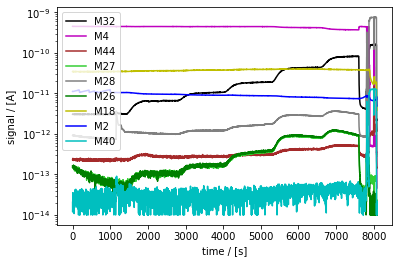

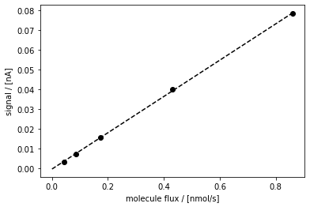

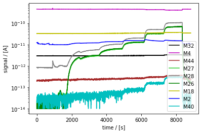

.. image:: EC-MS_ixdat_tutorial_files/EC-MS_ixdat_tutorial_42_4.png

Saving the calibration
----------------------

We might want to use the calibration for other measurements later, so
let’s create an ``ECMSCalibration`` object and save the calibration.

.. code:: ipython3

    from ixdat.techniques.ec_ms import ECMSCalibration
    
    # Now we put all these results together in an ECMSCalibration object:
    calibration = ECMSCalibration(
        name="SI_quant_appnote_calibration",  # Named for the article
        date="22-07-20",  # date of the calibration measurements
        setup="SI R&D1",  # setup where calibration was made
        ms_cal_results=cal_results,  # the mass spec calibrations
        RE_vs_RHE=0,  # the RE potential in [V]
        A_el=0.197,  # the geometric electrode area in [cm^2]
    )

.. code:: ipython3

    # save the calibration:
    calibration.export()  # this creates SI_quant_appnote_calibration.ix

Applying a calibration to your dataset
--------------------------------------

In the following we will explore how to apply the EC-MS calibration we
determined above to a dataset. There are several ways of how you can
pass a calibration to an ``ECMSMeasurement`` objects. We will only
address two ways here.

Let’s start by loading the calibration object that we saved earlier, as
well as loading some uncalibrated data and plotting it.

.. code:: ipython3

    loaded_cal = ECMSCalibration.read(
        "./SI_quant_appnote_calibration.ix"
    )
    
    good_bit = Measurement.read(
        "the_good_bit.csv", reader="ixdat"
    )
    good_bit.plot_measurement()

.. parsed-literal::

    skipping the following line:
    ixdat version = 0.2.5
    
    skipping the following line:
    backend_name = BackendBase(none, address=none)
    
    

.. parsed-literal::

    [<AxesSubplot:xlabel='time / [s]', ylabel='signal / [A]'>,
     <AxesSubplot:xlabel='time / [s]', ylabel='Ewe/V'>,
     None,
     <AxesSubplot:ylabel='<I>/mA'>]

.. image:: EC-MS_ixdat_tutorial_files/EC-MS_ixdat_tutorial_47_2.png

And apply the calibration on the data:

.. code:: ipython3

    good_bit.add_calibration(loaded_cal)
    
    # Check the MS calibration most recently added to the data
    print(good_bit.calibration_list[0].ms_cal_results)
    
    good_bit.plot_measurement()
    # good_bit.plot() # gives the same output as plot_measurement() here

.. parsed-literal::

    [MSCalResult(name=H2@M2, mol=H2, mass=M2, F=0.3378605863775754), MSCalResult(name=O2@M32, mol=O2, mass=M32, F=0.01182634523322349), MSCalResult(name=H2_M2_gas, mol=H2, mass=M2, F=0.3191356304426369), MSCalResult(name=O2_M32_gas, mol=O2, mass=M32, F=0.09198714869342346), MSCalResult(name=C2H4@M26, mol=C2H4, mass=M26, F=0.08057166014411674)]
    

.. parsed-literal::

    [<AxesSubplot:xlabel='time / [s]', ylabel='signal / [A]'>,
     <AxesSubplot:xlabel='time / [s]', ylabel='$U_{RHE}$ / [V]'>,
     None,
     <AxesSubplot:ylabel='J / [mA cm$^{-2}$]'>]

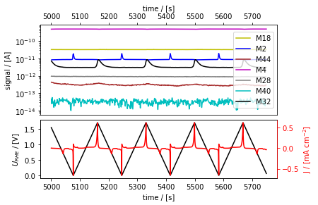

As we only provide the calibration for some of the masses, the standard
plot is still showing uncalibrated MS data. If we pass the list of
molecules where we do have a calibration, then ``plot_measurement()``
will plot the calibrated fluxes instead.

.. code:: ipython3

    good_bit.plot_measurement(mol_list=["H2", "O2"])

.. parsed-literal::

    [<AxesSubplot:xlabel='time / [s]', ylabel='signal / [mol/s]'>,
     <AxesSubplot:xlabel='time / [s]', ylabel='$U_{RHE}$ / [V]'>,
     None,
     <AxesSubplot:ylabel='J / [mA cm$^{-2}$]'>]

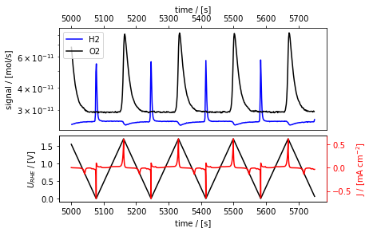

Alternatively, if we calculate the calibration factors in the same
``ixdat`` session as our data treatment, we can also directly apply the
calibration without having to create the calibration object first. In
this way, we can also make sure that we use a specific calibration
factor if we have determined several for one analyte.

.. code:: ipython3

    # Lets import the file again, so we can be sure there's no calibration attached yet
    good_bit2 = Measurement.read(
        "the_good_bit.csv", reader="ixdat"
    )
    # Add the EC calibration first
    good_bit2.calibrate(RE_vs_RHE=0, A_el=0.197)
    
    # Let's check what MS calibrations we have saved in our list
    print(cal_results)

.. parsed-literal::

    skipping the following line:
    ixdat version = 0.2.5
    
    skipping the following line:
    backend_name = BackendBase(none, address=none)
    
    [MSCalResult(name=H2@M2, mol=H2, mass=M2, F=0.3378605863775754), MSCalResult(name=O2@M32, mol=O2, mass=M32, F=0.01182634523322349), MSCalResult(name=H2_M2_gas, mol=H2, mass=M2, F=0.3191356304426369), MSCalResult(name=O2_M32_gas, mol=O2, mass=M32, F=0.09198714869342346), MSCalResult(name=C2H4@M26, mol=C2H4, mass=M26, F=0.08057166014411674)]
    

.. code:: ipython3

    # Let's calibrate using the EC-MS calibration for hydrogen and the gas calibration for oxygen
    good_bit2.calibrate(ms_cal_results=[cal_results[0], cal_results[3]])
    
    # Check the calibration most recently added to the data
    print(good_bit2.calibration_list[0].ms_cal_results)
    
    # And plot it once again:
    good_bit2.plot_measurement(mol_list=["H2", "O2"])

.. parsed-literal::

    [MSCalResult(name=H2@M2, mol=H2, mass=M2, F=0.3378605863775754), MSCalResult(name=O2_M32_gas, mol=O2, mass=M32, F=0.09198714869342346)]
    

.. parsed-literal::

    [<AxesSubplot:xlabel='time / [s]', ylabel='signal / [mol/s]'>,
     <AxesSubplot:xlabel='time / [s]', ylabel='$U_{RHE}$ / [V]'>,
     None,
     <AxesSubplot:ylabel='J / [mA cm$^{-2}$]'>]

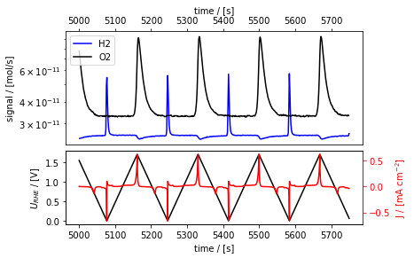

Plotting calibrated EC-MS data
==============================

Now that we’ve calibrated the data, we want to make some nice plots. In
the sections below, we will explore some ways of using ixdat’s plotter
and modify the plots using matplotlib.

EC-MS plot calibrated gases using two y axes
--------------------------------------------

.. code:: ipython3

    meas_a = good_bit.cut(tspan=[5035, 5200]) #cut the data to the interesting section
    meas_a.tstamp += meas_a.t[0]  #to get the figure showing the time starting at 0
    
    axes_a = meas_a.plot_measurement(
        mol_lists=[
            ["H2"],  # left y-axis
            ["O2"],  # right
        ],
        tspan_bg=[
            None,
            [0, 20],
        ],  # [left, right] y-axes
        unit=["nmol/s", "pmol/s/cm^2"],  # [left, right] y-axes
        logplot=False,
        legend=False, # e.g. if you want to add labels to the figure manually later
    )
    axes_a[0].set_ylabel("cal. sig. / [nmol s$^{-1}$]")
    axes_a[2].set_ylabel("cal. sig. / [pmol s$^{-1}$cm$^{-2}$]")
    
    fig_a = axes_a[0].get_figure()
    fig_a.savefig("fig_a.png")

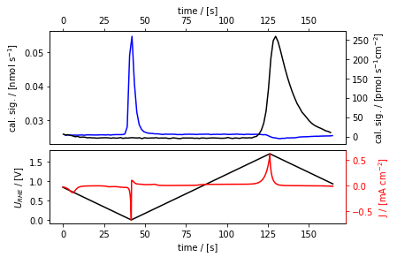

— Cyclic voltammetry MS plot of two of the cycles —

.. code:: ipython3

    meas_b = good_bit.as_cv() #by defining it as cv, meas_b.plot() would automatically plot vs potential
    #as soon as it's CV you can index by "cycle"
    meas_b.redefine_cycle(start_potential=0.4, redox=1)
    #now you can choose where a cycle starts, here defined as potential = 0.4, anodic/oxidizing = 1 (or True), cathodic/reducing = 0 (or False)
    #probably the syntax is inspired by biologic data, but it actually has nothing to do with the old biologic data
    #initial cycle is 0, first time the set condition is met, starts cycle 1 etc.
    
    axes_b = meas_b[1].plot_vs_potential(
        mol_list=["H2", "O2"],
        unit="pmol/s/cm^2",
        logplot=False,
        legend=False,
        remove_background=True, #should remove the minimum value from the cut dataset, but it is possible somewhere to actually 
        # the background (possibly where you define the dataset)
    )
    meas_b[3].plot_vs_potential(
        mol_list=["H2", "O2"],
        unit="pmol/s/cm^2",
        logplot=False,
        legend=False,
        remove_background=True,
        axes=axes_b, #to reuse the axis for co-plotting two separate parts of the measurement
        linestyle="--",
    )
    axes_b[0].set_ylabel("cal. sig. / [pmol s$^{-1}$cm$^{-2}$]")
    axes_b[0].set_xlabel(meas_b.U_name)
    
    fig_b = axes_b[0].get_figure()
    fig_b.savefig("fig_b.png")

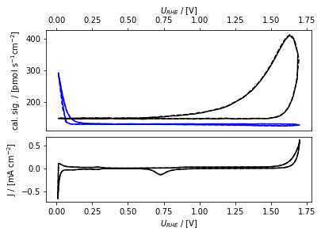

EC-MS plot with carrier gases on right y-axis (uncalibrated) and products on left (calibrated)
----------------------------------------------------------------------------------------------

Note that it is not possible to mix linear and logarithmic scales in one
plot with ixdat.

.. code:: ipython3

    meas_c = good_bit.cut(tspan=[5035, 5200])
    meas_c.tstamp += meas_c.t[0]
    
    meas_c.set_bg(
       tspan_bg=[0, 20], mass_list=["M2", "M32"]
    )
    
    axes_c = meas_c.plot_measurement(
        mol_lists = [[], ["H2", "O2"]], # left y-axis
        logplot=False,
        legend=False,
    )
    meas_c.plot_measurement(
       mass_list=["M4", "M28", "M40"],  # right y-axis
        #unit=["nmol/s"],  # [left, right] y-axes
        logplot=False,
        legend=False,
        axes=axes_c, #to reuse the axis for co-plotting two separate parts of the measurement
        #linestyle="--",
    )
    axes_c[2].set_ylabel("cal. sig. / [nmol s$^{-1}$]")
    # axes_c[-1].set_ylim(bottom=-5)
    
    fig_c = axes_c[0].get_figure()
    fig_c.savefig("fig_c.png")

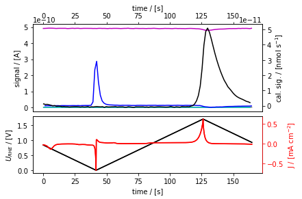

EC-MS plot with a third with system parameters added
----------------------------------------------------

In some cases it can be interesting to co-plot some other data,
e.g. system parameters like iongauge pressure or MFC flow rates. Let’s
have a look at the iongauge pressure during one of the CV cycles and
plot that in a third panel of our regular EC-MS plots.

.. code:: ipython3

    from matplotlib import pyplot as plt
    from matplotlib import gridspec
    
    # since we want to co-plot system parameters here, which were not part of the exported dataset, we need to use another version
    # of our dataset # imported above, which hasn't been calibrated yet, so let's quickly calibrate that now
    meas_part.add_calibration(loaded_cal)
    
    
    # cut the relevant part from a big dataset
    meas_d = meas_part.cut(tspan=[5035, 5200])
    
    # grab the iongauge pressure
    ig1 = meas_d.grab("Iongauge value [mbar]")
    
    # create a figure with 3 panels
    fig_4 = plt.figure()
    gs = gridspec.GridSpec(7, 1, fig_4)
    ax_ms = plt.subplot(gs[0:3, 0]) # MS signals panel
    ax_ms_right = ax_ms.twinx()     # right axis for the MS signals, not used here
    ax_ec = plt.subplot(gs[3:5, 0]) # EC signals panel
    ax_ec_right = ax_ec.twinx()     # axis for the current
    ax_ig= plt.subplot(gs[5:7, 0]) # Ion Gauge panel
    fig_4.set_figheight(7)
    fig_4.set_figwidth(fig_4.get_figheight() * 1.25)
    
    ax_ms.tick_params(
        axis="x", top=True, bottom=True, labeltop=True, labelbottom=False
    )
    ax_ec.tick_params(
        axis="x", top=True, bottom=True, labeltop=False, labelbottom=False
    )
    ax_ig.tick_params(
        axis="x", top=True, bottom=True, labeltop=False, labelbottom=True
    )
    
    ax_ms.set_xlabel("time / [s]")
    ax_ms.xaxis.set_label_position("top")
    
    ax_ig.set_xlabel("time / [s]")
    ax_ig.set_ylabel("IG pressure / [mbar]")
    ax_ms.set_ylabel("Signal / [A]")
    ax_ms.set_yscale("log")
    
    
    ax_ec.set_ylabel("U$_{RHE}$ / (V)")
    ax_ec_right.set_ylabel("J$_{total}$ / (mA cm$^{-2}$)", color="red")
    
    
    # add the MS and EC data to the correct axes using ixdat's "plot measurement"
    meas_d.plot_measurement(axes=[ax_ms, ax_ec, ax_ms_right, ax_ec_right])
    # this overwrites some of the axis labels, so we need to define them (again) if we want them non-standard
    ax_ec.set_xlabel("")
    ax_ec_right.set_xlabel("")
    
    # add the iongauge data from the "grabbed" data series
    ax_ig.plot(ig1[0], ig1[1])

.. parsed-literal::

    [<matplotlib.lines.Line2D at 0x2be40b32640>]

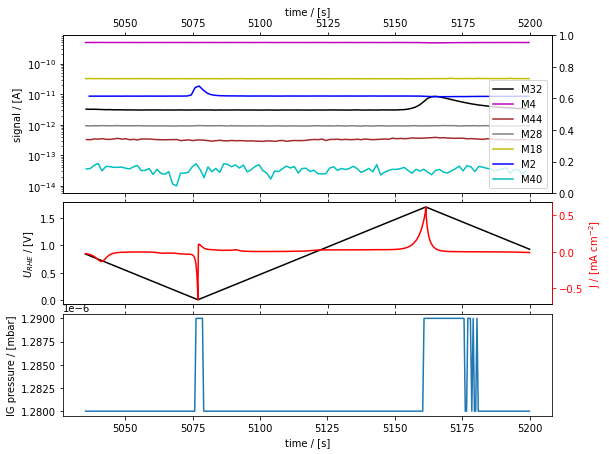

Congratulations! You have reached the end of this tutorial and are now
an expert in loading, calibrating and plotting EC-MS data using
``ixdat``.
