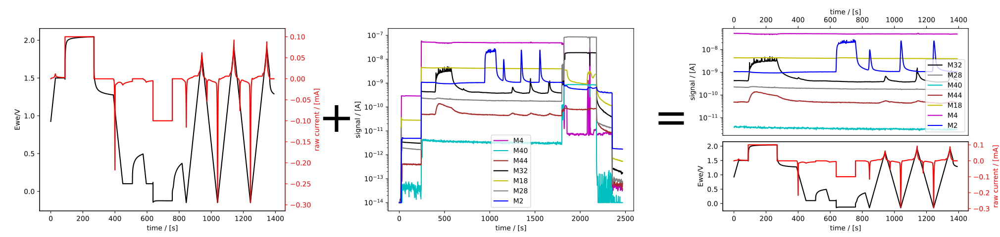

Documentation for ``ixdat``
###########################
Welcome to ``ixdat`` - The in-situ experimental data tool
^^^^^^^^^^^^^^^^^^^^^^^^^^^^^^^^^^^^^^^^^^^^^^^^^^^^^^^^^

With ``ixdat``, you can import, combine, and export complex experimental datasets
as simply as::

    ec = Measurement.read_set("awesome_EC_data", reader="biologic")
    ec.plot_measurement()

    ms = Measurement.read("2021-03-30 16_59_35 MS data.tsv", reader="zilien")
    ms.plot_measurement()

    ecms = ec + ms
    ecms.plot_measurement()

    ecms.export("my_combined_data.csv")

Output:

    In-situ experimental data made easy

Or rather than exporting, you can take advantage of ``ixdat``'s powerful analysis
tools and database backends to be a one-stop tool from messy raw data to public
repository accompanying your breakthrough publication and advancing our field.

This documentation page is structured as follows: The :ref:`Introduction` gives a brief intro to the concept and has a list of the techniques and file types supported so far. In :ref:`getting_started` you have the info on how to install ``ixdat`` on your computer, as well as several tutorials guiding you through ``ixdat``'s vast possibilities. If you want to know more about the concept, or check out the in-depth code documentation, check out :ref:`diving_deeper`. And finally, if you want to contribute to our open-source project, find out more at :ref:`developing`.

If you have any feedback, comments or questions, find out how to contact the ixdat team here: :ref:`questions`.
This documentation, like ``ixdat`` itself, is a work in progress and we appreciate any feedback or requests.

.. toctree::
    :maxdepth: 3

    introduction
    getting_started/index
    tutorials/index
    diving_deeper/index
    developing/index
    questions
    license

Indices and tables
==================

* :ref:`genindex`
* :ref:`modindex`
* :ref:`search`
