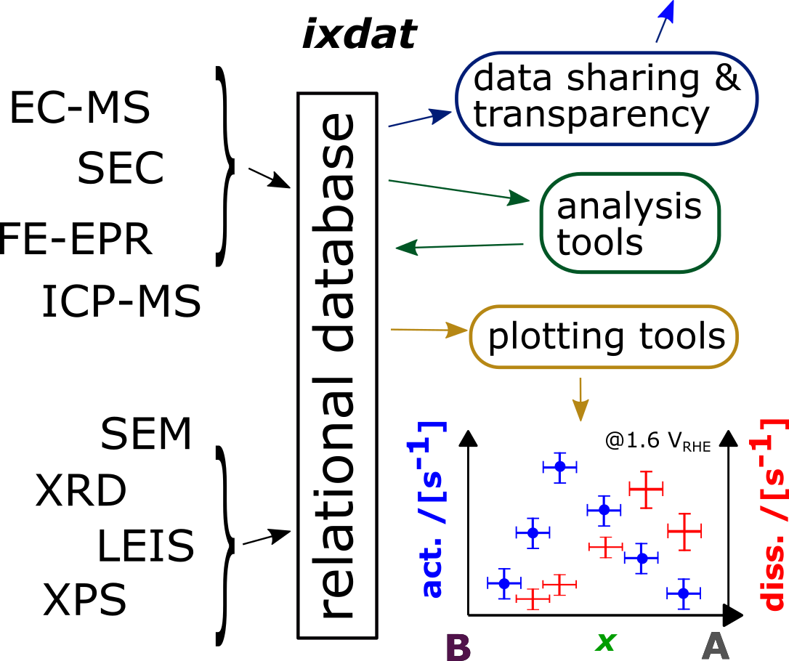

.. _Introduction:

============
Introduction
============

``ixdat`` provides a powerful **object-oriented** interface to experimental data,
especially in-situ experimental data for which it is of interest to combine data obtained
simultaneously from multiple techniques.
In addition to a **pluggable** ``reader`` interface for importing your data format, it
includes pluggable exporters and plotters, as well as a database interface.

For the philosophy behind ixdat, see :ref:`concept`.

``ixdat`` is free and open source software and we welcome input and new collaborators.
See :ref:`developing`.

Supported techniques
--------------------

.. list-table:: Techniques and Readers
   :widths: 20 15 50
   :header-rows: 1

   * - Measurement technique
     - Status
     - Readers
   * - :ref:`electrochemistry`
     - Released
     - - biologic: .mpt files from Biologic's EC-Lab software
       - autolab: ascii files from AutoLab's NOVA software
       - ivium: .txt files from Ivium's IviumSoft software
   * - :ref:`mass-spec`
     - Released
     - - pfeiffer: .dat files from Pfeiffer Vacuum's PVMassSpec software
       - cinfdata: text export from DTU Physics' cinfdata system
       - zilien: .tsv files from Spectro Inlets' Zilien software
   * - :ref:`ec-ms`
     - Released
     - - zilien: .tsv files from Spectro Inlets' Zilien software
       - EC_MS: .pkl files from the legacy EC_MS python package
   * - :ref:`sec`
     - Released
     - - msrh_sec: .csv file sets from Imperial College London's SEC system
   * - X-ray photoelectron spectroscopy (XPS)
     - Future
     -
   * - X-ray diffraction (XRD)
     - Future
     -
   * - Low-Energy Ion Scattering (LEIS)
     - Future
     -

Installation
------------

To use ``ixdat``, you need to have python installed. We recommend
`Anaconda python <https://www.anaconda.com/products/individual>`_.

To install ``ixdat``, just type in your terminal or Anaconda prompt::

    $ pip install ixdat

And hit enter.

``ixdat`` is under development, and to make use of the newest features,
you may need to upgrade to the latest version. This is also easy. Just type::

    $ pip install --upgrade ixdat

ixdat workflow
--------------

    The power of combining techniques