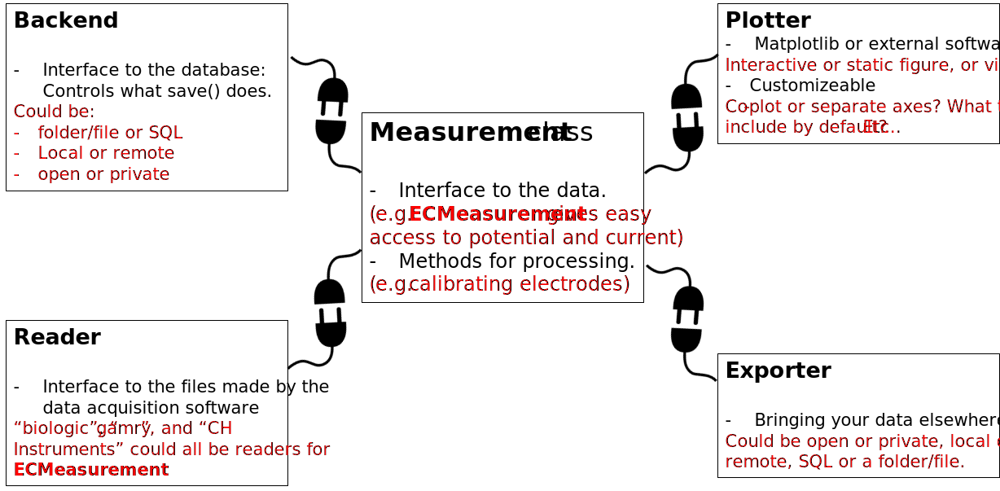

.. _Introduction:

============
Introduction
============

``ixdat`` provides a powerful **object-oriented** interface to experimental data,
especially in-situ or online experimental data for which it is of interest to combine data obtained
simultaneously from multiple techniques. Being centered around timestamps, ``ixdat`` allows you to smoothly connect data
recorded with different techniques.

The concept is illustrated in the figure below: A ``measurement`` object interfaces with the data from one or more techniques,
which can be treated using **built-in methods**, or can be retrieved in the form of an array, for maximum flexibility.
Data in **various formats** is read in with the corresponding ``reader`` and can be plotted with a ``plotter``, exported with an ``exporter`` (e.g. for treatment using other tools), or simply stored for later use in a database connected to ``ixdat``.
To allow for this broad functionality, ``ixdat`` comes with a **pluggable** ``reader`` interface for importing your data format, as well as **pluggable** ``exporter`` and ``plotter`` and database.

Get started today with one of the tutorials available under :ref:`tutorials`. If you're curious about the details of ``ixdat``'s structure and the available readers, plotters and exporters, check out the section :ref:`diving_deeper`.

Supported techniques
--------------------

Following techniques and asscociated file formats are currently supported:

.. list-table:: Techniques and Readers
   :widths: 20 15 50
   :header-rows: 1

   * - Measurement technique
     - Status
     - Readers
   * - :ref:`electrochemistry`
     - Released
     - - biologic: .mpt files from Biologic's EC-Lab software
       - autolab: ascii files from AutoLab's NOVA software
       - ivium: .txt files from Ivium's IviumSoft software
   * - :ref:`mass-spec`
     - Released
     - - pfeiffer: .dat files from Pfeiffer Vacuum's PVMassSpec software
       - cinfdata: text export from DTU Physics' cinfdata system
       - zilien: .tsv files from Spectro Inlets' Zilien software
   * - :ref:`ec-ms`
     - Released
     - - zilien: .tsv files from Spectro Inlets' Zilien software
       - EC_MS: .pkl files from the legacy EC_MS python package
   * - :ref:`sec`
     - Released
     - - msrh_sec: .csv file sets from Imperial College London's SEC system
   * - X-ray photoelectron spectroscopy (XPS)
     - Development
     - - avantage: .avg files from Thermo Scientific's Avantage software
   * - X-ray diffraction (XRD)
     - Development
     - - xrdml: .xrdml files from e.g. PanAnalytical's Empyereon
   * - In-situ Electrochemistry - X-ray adsorption spectroscopy (XAS)
     - Development
     - - qexafs: .dat files from Diamond's B18 beamline
   * - Low-Energy Ion Scattering (LEIS)
     - Future
     -

Missing something?
------------------

Is the technique or reader for the file format you're looking for not available yet? Then you have two options:

- Contribute with a new feature: ``ixdat`` is a free and open source software and we welcome input and new collaborators. See :ref:`developing`

OR

- Let the ixdat team know at https://github.com/ixdat/ixdat/issues
