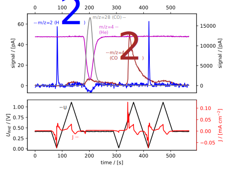

.. _ec-ms:

Electrochemistry - Mass Spectrometry (EC-MS)
============================================

The main class for EC-MS data is the ECMSMeasurement.

It comes with the :ref:`EC-MS plotter <ecms-plotter>` which makes EC-MS plots like this one:

   ``ECMSMeasurement.plot_measurement()``. Data from Trimarco, 2018.

Other than that it doesn't have much but inherits from both ``ECMeasurement`` and ``MSMeasurement``.
An ``ECMSMeasurement`` can be created either by adding an ``ECMeasurement`` and an ``MSMeasurement``
using the ``+`` operator, or by directly importing data using an EC-MS :ref:`reader <readers>`
such as "zilien".

``ECMSCyclicVoltammogram`` adds to ``ECMSMeasurement`` the tools for selecting and analyzing data
based on an electrochemical cyclic voltammatry program that are implemented in ``CyclicVoltammogram``
(see :ref:`cyclic_voltammetry`).

.. Deconvolution, described in a `recent publication <https://doi.org/10.1021/acs.analchem.1c00110>`_,
is implemented in the deconvolution module, in a class inheriting from ``ECMSMeasurement``.

``ixdat`` has all the functionality and more for EC-MS data and analysis as the
legacy `EC_MS <https://github.com/ScottSoren/EC_MS>`_ package. This includes the tools
behind the EC-MS analysis and visualization in the puplications:

- Daniel B. Trimarco and Soren B. Scott, et al. **Enabling real-time detection of electrochemical desorption phenomena with sub-monolayer sensitivity**. `Electrochimica Acta, 268, 520-530  <https://doi.org/10.1016/j.electacta.2018.02.060>`_, **2018**

- Claudie Roy, Bela Sebok, Soren B. Scott, et al.  **Impact of nanoparticle size and lattice oxygen on water oxidation on NiFeOxHy**. `Nature Catalysis, 1(11), 820-829  <https://doi.org/10.1038/s41929-018-0162-x>`_, **2018**

- Anna Winiwarter and Luca Silvioli, et al. **Towards an Atomistic Understanding of Electrocatalytic Partial Hydrocarbon Oxidation: Propene on Palladium**. `Energy and Environmental Science, 12, 1055-1067 <https://doi.org/10.1039/C8EE03426E>`_, **2019**

- Soren B. Scott and Albert Engstfeld, et al.  **Anodic molecular hydrogen formation on Ru and Cu electrodes**. `Catalysis Science and Technology, 10, 6870-6878 <https://doi.org/10.1039/d0cy01213k>`_, **2020**

- Anna Winiwarter, et al.  **CO as a Probe Molecule to Study Surface Adsorbates during Electrochemical Oxidation of Propene**. `ChemElectroChem, 8, 250-256 <https://doi.org/10.1002/celc.202001162>`_, **2021**

``ixdat`` is used for the following EC-MS articles:

- Soren B. Scott, et al.  **Tracking oxygen atoms in electrochemical CO oxidation –Part I: Oxygen exchange via CO2 hydration**. `Electrochimica Acta, 374, 137842 <https://doi.org/10.1016/j.electacta.2021.137842>`_, **2021**.

  Repository: https://github.com/ScottSoren/pyCOox_public

- Soren B. Scott, et al.  **Tracking oxygen atoms in electrochemical CO oxidation –Part II: Lattice oxygen reactivity in oxides of Pt and Ir**. `Electrochimica Acta, 374, 137844 <https://doi.org/10.1016/j.electacta.2021.137844>`_, **2021**.

  Repository: https://github.com/ScottSoren/pyCOox_public

- Kevin Krempl, et al. **Dynamic Interfacial Reaction Rates from Electrochemistry - Mass Spectrometry**. `Journal of Analytical Chemistry. 93, 7022-7028 <https://doi.org/10.1021/acs.analchem.1c00110>`_, **2021**

  Repository: https://github.com/kkrempl/Dynamic-Interfacial-Reaction-Rates

- Junheng Huang, et al. **Online Electrochemistry−Mass Spectrometry Evaluation of the Acidic Oxygen Evolution Reaction at Supported Catalysts**. `ACS Catal. 11, 12745-12753 <https://doi.org/10.1021/acscatal.1c03430>`_, **2021**

  Repository: https://github.com/ScottSoren/Huang2021

The ``ec_ms`` module
--------------------
Source: https://github.com/ixdat/ixdat/tree/user_ready/src/ixdat/techniques/ec_ms.py

.. automodule:: ixdat.techniques.ec_ms
    :members:

The ``deconvolution`` module
----------------------------
Source: https://github.com/ixdat/ixdat/tree/user_ready/src/ixdat/techniques/deconvolution.py

.. automodule:: ixdat.techniques.deconvolution
    :members: